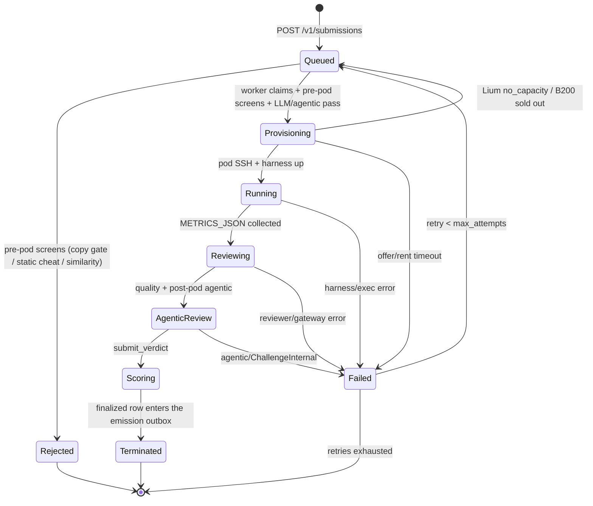

# PRISM challenge (Base)

**challenge_id:** `prism`  
**competition_id:** `prism-v2.1` (`scoring_generation` `21`) — **new contest**. Recipe `2.0.0` / 1.x harvests are a different competition: they are **not** rescored and **cannot** win or carry leaves. `GET /v1/weights/latest` stays fail-closed **burn** (uid 0 = 100%, `sealed: false`) until the first terminated, weight-eligible v2.1 submission exists, then normal WTA/benchmarks emission.  
**scoring_version:** `4` live (equal-weight **G2 public-suite accuracies** → lattice; tokenizer length no longer farms the leaf). Legacy: `2` = pure bits/token bpb (`PRISM_SCORING_MODE=shadow`); `3` = full G1–G8 composite (`composite`, anchors required). Default mode is `benchmarks`. See **v4 G2 benchmark scoring** and **v3 composite scoring** below. **v2.1 additions (opt-in, default-off):** emission economics (`PRISM_EMISSION_MODE`, `PRISM_OWNER_ARCH_CREDIT_BPS`) + versioned battery anchors (`PRISM_ANCHOR_VERSION`, sets v0–v3). See **v2.1 innovation-scoring additions** below.

**recipe_version:** `2.1.0` (pinned NeMo AutoModel diff + 4-GPU CUDA 13/TE pod + attested dual cap + complete v3 battery; legacy **1.x** layouts rejected — see [`PRISM_RECIPE.md`](PRISM_RECIPE.md))
**port:** `8092`  
**emission_share_bps:** `10000` (100% prism; sum `10000`)  
**GPU path:** master-centralized **Lium** (no Phala CVM)

## What it is

PRISM on Base (recipe **2.1.0**) accepts miner submissions as a **unified
diff against a pinned [NeMo AutoModel](https://github.com/NVIDIA-NeMo/Automodel)
checkout** — ZIP members `automodel.base` (pin id) + `automodel.patch` (+
optional `prism.toml`). Megatron-Bridge and free-form
`architecture.py` / `training.py` (or 1.x source-tree) layouts are **not**
accepted on live. Novel architectures remain allowed when expressed as
AutoModel extensions in the patch. Full pin fields and ZIP layout:
[`PRISM_RECIPE.md`](PRISM_RECIPE.md).

Each evaluation runs on a Lium GPU pod **or Verda serverless job funded by
the miner** via `X-Lium-Api-Key` **or** Verda BYOK (`X-Verda-Client-Id` /
Secret / `X-Verda-Inference-Key`) (Sim backend in CI only). Intake applies the patch
fail-closed onto the pin; the delta is persisted for
`GET /v1/submissions/{id}/diff`. Copy / similarity / agentic review focus on
the **miner delta** (touched files / hunks), then the shared **agentic**
anti-cheat verifier (`challenge-agentic`: tools + AST + metrics/receipt;
OpenRouter when keyed, `SimAgent` in CI). The harness wrap still enforces
the **telemetry contract** (`prism_telemetry.report` +
`finish_evaluation`); missing or stripped hooks are a hard contract
violation (`missing_telemetry_hooks` → `Score(0)`, terminal). Cheap
`Copied` is a hard first filter; cheap `Suspicious` hard-zeros only when
`score ≥ 0.9` (`SUSPICIOUS_HARD_ZERO_THRESHOLD`) and evidence is not
generic-trope-only. Agentic is the primary anti-cheat judge and must not
treat standard LM components as plagiarism. The LLM quality vote is a
**coherence gate, never a grader**: the live leaf is the **v4 G2 benchmark
lattice** (equal-weight mean of public-suite accuracies), with hard-zero on
agentic `cheat`/`suspicious` and cheap `Copied` / high-confidence
`Suspicious`. Missing agentic verdict is fail-closed (`ChallengeInternal`).
Leaves are D24-complete per chain epoch, emitted at
epoch close from the finalized-since-last-epoch batch (see **Leaf emission**
below). Review findings are audit events, not points.

> **Historical 1.x path.** Recipe ≤ 1.4.0 accepted two-script
> (`architecture.py` + `training.py`), training-only + `arch_id`, and
> source-tree ZIPs. That contract text remains in
> [`PRISM_RECIPE.md`](PRISM_RECIPE.md) (legacy section) and in the
> architecture-registry sections below for leaf/audit continuity; live
> intake under 2.0 rejects those layouts (`unsupported_layout` /
> `recipe_version`).

This is **not** agent-challenge Phala/TDX attestation and **not**
hypertraining B300 tournament code.

## Orchestration state machine



All transitions are append-only events in `prism_stage_event`; the row state
lives in `prism_submission`. Live measure runs the harness **detached** on the
pod (`setsid` + `harness.log` / `harness.pid`) so a control-plane restart does
not SIGHUP GPU work. On boot (and every ~30s) orphan reconcile is
**resume-first**: mid-flight `provisioning`/`running` rows whose Lium pod is
still alive and whose BYOK key can be restored from the sealed vault
(`PRISM_PAYER_VAULT_DIR`, default TTL ≥**36h** / train+eval+skew; heartbeats
re-seal; measure start refreshes the seal and **measure Err keeps the vault
entry** so auto-/miner-retry can re-rent) are requeued with `pod_id` kept. `claim_next` prefers those resume rows over
new submits so they do not wait behind the FIFO (and so workers call
`resume_eval` instead of a second `lium rent`). The
orchestrator reattaches
(log/event poll → wait terminal → harvest → score) without terminating the
pod. `GET /v1/submissions` lists omit source trees / telemetry series so the
control plane cannot OOM the master host by hydrating hundreds of `tree_blob`
columns. Only unreattachable rows fail-closed (`control_plane_restart` /
`harness_detached`) with best-effort terminate. Post-measure review stages
still requeue. Residual gap: expired seal + no operator fallback ⇒ cannot
call Lium API ⇒ fail-orphan (miner must stop the pod and resubmit). The stuck
sweeper remains a **10h** backstop and skips live workers.
`GET /v1/submissions/{id}/logs?since=` exposes harvested harness tails +
heartbeats while a pod is measuring.

**Metrics harvest (v3):** the harness writes `METRICS_JSON=` to stdout **and**
`/tmp/prism_eval/metrics.json`. Master harvest prefers that sidecar (else
`grep '^METRICS_JSON=' harness.log`) plus terminal markers — it must not rely
on a fixed-byte `tail` of `harness.log` alone. Battery blobs often exceed
32 KiB; a tail that keeps `EVAL_OK` but drops the `METRICS_JSON=` prefix
falsely fails the run after GPU work. Failed rows whose `error_detail` only
retains a truncated log (no recoverable `bpb` / `metrics_json`) **cannot** be
offline-recovered from the DB — after deploying this fix, operators
`POST /v1/submissions/{id}/retry` (admin Bearer) and
`POST /v1/admin/gating/{hotkey}/reset` so the miner can re-run measure.

Evaluation (Lium / Sim, review, agentic, leaf emit) is **master-only**.
Validators never run `prism-challenge` — they fetch sealed weights only.

## Submission gating (shared with design)

Intake requires the miner hotkey **in the metagraph** (cached snapshot) and
enforces **one accepted submission per `(prism, hotkey)`**
(`submission_gating` table): non-`open` rows → `409 submission_gated`;
unknown hotkey → `403 hotkey_not_in_metagraph`. Infra-class failures
(`install` = Lium/pod, `ast_infra` = similarity, `llm_infra` = review/agentic)
**auto-retry up to 3 times** before a terminal `blocked`; cheat / suspicious
verdicts are terminal `rejected` (no retry). Retries of a **post-run** failure
(`llm_infra` / `ast_infra` after the pod job completed) resume from the
persisted measurement — the train+eval job is never re-run for a master-side
review failure; only `install` retries re-provision. Lium **HTTP 429** on rent is
special: each miner `X-Lium-Api-Key` has its **own** Lium budget (no shared
process-wide rent serialize queue). The orchestrator **requeues without
burning** `retry_count` / gating attempts. A background tick re-queues
failed 429 rows from the last **6 hours**. **No matching 1× B200 offer**
(`no_capacity` / sold out) is the same class: the row stays **`queued`**
(not `failed` / Score(0)), events and `error_detail` carry
`B200s are currently out of capacity on Lium; this job is queued until an offer appears.`,
and the next `claim_next` tick retries **rent only** on the miner BYOK key
(similarity / LLM review / pre-pod agentic stay on the row — they are not
re-run every sold-out tick). Template
permission / auth / bad ZIP stay fails (Lium already retries a rentable
template once). After an infra `blocked`, the
miner may **`/retry` or re-POST the same bytes** for `ChallengeInternal`
without a time cutoff. A *different* ZIP is only accepted inside the
**30-minute** infra window; after that the slot stays blocked until the
metagraph watcher reopens it (hotkey left / replaced).

**Training-only entries** gate separately under the composite challenge key
`prism:train:<arch_id>`: one accepted entry per `(hotkey, arch_id)`, with
the same auto-retry classes, the same terminal `rejected`/`blocked` states,
and the same watcher resets (reconciliation is prefix-scoped, so `prism`
covers every `prism:train:*` row). Idempotency stays the contract-bytes
`submission_id`: resubmitting identical in-flight / successful bytes is an
`already-queued` no-op (never a gate conflict). A failed `ChallengeInternal`
row is recovered by that same POST or `/retry`. Pre-pod mid-flight rows
(`llm_review` / `similarity` / `provisioning` with no `pod_id`) requeue on
control-plane restart instead of fail-orphan with `pod (none)`.

## Architecture registry + competition

Since recipe **1.2.0**, PRISM is an **architecture competition**, not only a
training tournament.

**Registry (`prism_architecture`, migration 0010).** An architecture becomes
*published* — referenceable by other miners — only after its owning
submission survived every gate (copy gate, LLM review, agentic) and reached
`terminated` with a real measured score. Rejected/cheated architectures
never publish. `arch_id = arch_<first 16 hex of sha256(architecture_py)>`;
the full digest is unique (simultaneous identical architectures share the
first registration; the copy gate makes later copies terminal anyway).

**Training-only submissions.** Body: `training.py` + `arch_id`
(`architecture_py` empty — source is pulled from the registry at intake and
denormalized onto the row; ZIP path: `training.py`-only archive +
`X-Prism-Arch-Id` header). Unknown `arch_id` → `404 unknown_arch`; inline
source with `arch_id` → `400`. Training-only rows **skip** the copy gate and
the similarity judgment (their architecture is registry-identical by design)
and are exempt from the agentic corpus-copy check against their own arch;
the telemetry-hooks rule and metrics forge checks still apply. Gating:
`prism:train:<arch_id>` as above — one accepted entry per
`(hotkey, arch_id)`, retries same rules.

**Leaf emission (epoch-close, exactly-once outbox + score carry + tip refresh).** A
submission row's acceptance epoch (`prism_submission.epoch`) is intake
metadata only. A dedicated emitter loop (`prism-emit`) emits a
**D24-complete leaf set** for the live chain epoch: the first tick that
observes epoch `E` assigns every submission finalized since the previously
emitted epoch — the outbox batch,
`kind IS NOT NULL AND emitted_epoch IS NULL` — to `E`, competition-aggregates
that batch **unioned with every still-active positive lattice score**
(`kind = 'score' AND score > 0`), signs the full expected set
(`NoScore(NotAttempted)` for everyone else), submits it, and advances the
per-netuid emit cursor (`prism_emit_cursor`, migration 0012). Later ticks on
the same tip **re-submit** the current WTA projection so a mid-epoch champion
change tip-supersedes gateway leaves (`payload_digest` change → 202; identical
digest → 409-as-ok). Cursor does not advance again on tip refresh. This fixes
the acceptance-epoch bugs (a submission accepted in epoch `X` but finalized in
`X+k` never scored) while keeping `/v1/weights/latest` aligned with live WTA
after tip reseal. Architecture-owner credit stays off
(`OWNER_ARCH_CREDIT_ENABLED = false`).

Exactly-once **outbox assignment** per scoring run: batch assignment is sticky
before submit, the cursor advances only after the first full set for an epoch
landed, and a crash mid-submit replays the identical assigned set on the next
tick. After assignment, a positive `Score(v>0)` keeps participating in every
later epoch's competition set until a better/valid score supersedes it via
lattice `max` — so an empty or reject-only fresh batch does not burn the prism
share. Leaf emission then applies **winner-take-all**
(`prism_registry::apply_wta`): only the single highest positive credit
(lexicographically smallest hotkey on ties) receives a positive Score leaf;
every other positive credit is zeroed. `Score(0)` rejects and `NoScore`
absences do not carry. A manually retried + re-scored row re-enters the outbox
(`reset_for_retry` clears the watermark). Epochs during a master outage carry
no *new* outbox rows; the first epoch after recovery still includes active
positive scores plus any backlog (seals always pin fresh epochs — stale
bundles can never Match on-chain). Run **exactly one** prism-challenge emitter
instance per netuid (single master topology). The WTA collapse is the
default emission projection; `PRISM_EMISSION_MODE=top3` (v2.1, opt-in)
swaps it for the top-3 decaying split — see **v2.1 innovation-scoring
additions**.

**Competition scoring (epoch-local, SCORE_MAX lattice preserved; prism
`SCORING_VERSION` stays 2 — the competition reallocates credits inside the
existing lattice, and epoch-close batching changes only *which* epoch a score
lands in, not the leaf format or the math).** Per emitted epoch set:

- *submitter credit* (normative): a hotkey's own best lattice score across its
  rows in the epoch's competition set (fresh outbox + active carry). Credit
  attaches to `miner_hotkey` on the scored submission — the UID that **posted**
  the run — never to the architecture registry owner.
- *architecture-owner credit*: the legacy pre-WTA path stays **disabled**
  (`OWNER_ARCH_CREDIT_ENABLED = false` in `prism-registry`; do not flip).
  Arch ownership still exists for top-model / publish bookkeeping. The
  sanctioned owner-credit mechanism is the **v2.1 post-collapse split**
  (`PRISM_OWNER_ARCH_CREDIT_BPS`, default 0 — see **v2.1
  innovation-scoring additions**), which redistributes only the winner's
  own leaf and cannot re-route emission to off-metagraph owners.
- *per-hotkey credit*: **own score only** (best-BPB submitter). `Score(0)`
  rows (cheat/copy-gate) never win; hotkeys whose rows are all `NoScore` keep
  their absence.
- *WTA emission*: argmax over positive per-hotkey credits → one Score leaf;
  Prism's emission share (50% of the subnet) goes entirely to that **submitter**
  (best BPB → that submission's miner UID).
- *Recipe 2.1 / `prism-v2.1` weight eligibility* (fail-closed): only harvests
  whose metrics carry recipe `2.1.x`, `competition_id=prism-v2.1`, or
  `scoring_generation=21` may enter `emission_leaves` as winners or carry.
  Recipe `2.0.0`, AutoModel-pin-only rows, and 1.x trees are the **previous
  contest** — they stay in Postgres / site history as `Score(0)` for
  emission and are never retroactively rescored. Empty registry or
  old-generation-only positives project all-zero (gateway burn / hold)
  until the first eligible v2.1 termination. See **v2.1 competition
  cutover** in [`../../deploy/AGENTS.md`](../../deploy/AGENTS.md) § Prism Lium GPU profiles.

**Top-model publish + secure receive.** The master tracks the global best
**lattice score** (G2 equal-weight accuracies under `scoring_version` 4 —
never min-bpb alone) across **weight-eligible** (recipe 2.1 / `prism-v2.1`)
  scored submissions. After a successful Lium eval it
**pulls** `checkpoint.pt` from the pod over SSH (master-initiated; the pod
never pushes) and stages it through the secure receive hook into
`$PRISM_ARTIFACT_DIR/<submission_id>/` **before** terminate. Staging
fail-closes on oversized packs, unexpected tar members, path traversal /
symlinks, and writes `MANIFEST.json` + `RECEIPT.json` (sha256).
Default park root is `/var/lib/prism/artifacts` (compose volume
`prism-artifacts`); the image pre-creates it owned by uid **65532** (`base`).
Harvest calls `ensure_artifact_root` first — a missing/unwritable root
surfaces as `lium exec: mkdir <path>: Permission denied …` (not a silent
skip). Re-create or `chown 65532` the volume if an older empty root-owned
volume was already provisioned.

**Size budget (FP32 × 2 × 1.5).** Cap = `n_params × 4 × 2 × 1.5` bytes =
`n_params × 12` (exact integer; see `prism_artifacts::checkpoint_byte_budget`).
The v3 harness parks FP32 `torch.save` state_dicts; `n_params` dedupes tied
weights (embed ↔ lm_head) but the pickle can materialize each state_dict key,
so the budget includes a 2× tying factor on top of 1.5× pickle/tar overhead.
Harvest uses the harness-measured `n_params` from `METRICS_JSON`; when
missing (older harness), it falls back to `prism_recipe::max_params()`
(1B, or `PRISM_TEST_MAX_PARAMS` in staging). Admin
`POST /v1/admin/artifacts/{id}/receive` resolves `n_params` from the
submission store, else requires `X-Prism-N-Params` (fail-closed if
unknown). HTTP body ceiling is recipe-max × 12 (~11.18 GiB at the 1B cap);
the per-receive
check is tighter when measured params are known. Oversized payloads are
refused **before** writing.

Top-model publish calls `verify_parked` and refuses weights without a
valid receipt. On a new global-best lattice score (≥ best ever and >
last published score), it
publishes `architecture.py` + `training.py` + `METRICS.json` +
`ARTIFACT.json` + a `README.md` block to the public
[`BaseIntelligence/prism`](https://github.com/BaseIntelligence/prism) repo
under `top-model/` via the GitHub contents API; large checkpoints upload as
a mutable Release tag `prism-top-model`. The same trigger also commits a
**reloadable custom-arch pack** to HuggingFace
(`PRISM_TOPMODEL_HF_TOKEN_FILE`, default repo
`BaseIntelligence/top-prism-architecture`): seam sources, AutoModel novelty
under `sources/`, `config.json` + `trust_remote_code` wrappers, and
`checkpoint.pt` (LFS when large; Hub LFS PUT uses a bare HTTP client so
pre-signed storage auth is not dual-Authorization). HF publish is
**fail-closed** on missing receipt when `PRISM_TOPMODEL_REQUIRE_WEIGHTS=1`
(same as GitHub). The Hub README leads with public G2 benches vs
**GPT-2 Large** (↑/↓ / ✓ better|worse) plus compute/TFLOPS notes and the
Base banner. The publication is journaled
(`prism_topmodel_publication`). GitHub token:
`PRISM_TOPMODEL_GITHUB_TOKEN_FILE` (`deploy/secrets/github/token`);
absent/empty → publish no-op. With `PRISM_TOPMODEL_REQUIRE_WEIGHTS=1`
(default), a missing/invalid receipt fails the publish (no journal).
Operators may re-stage via `POST /v1/admin/artifacts/{id}/receive` (same
admin Bearer; requires `X-Prism-Sha256`; `n_params` from store or
`X-Prism-N-Params`) — never an open pod upload.

## v4 G2 benchmark scoring (live default)

**Breaking change vs v2:** the emission leaf is no longer
`score_from_bpb` (bits/token). Tokenizer length cannot farm the rank.
`PRISM_SCORING_MODE` modes (`prism-pipeline::ScoringMode`):

| Mode | Leaf score | `scoring_version` on rows |
|------|-----------|---------------------------|
| `benchmarks` (**default**) | equal-weight mean of available G2 public accuracies → `round(SCORE_MAX × mean)` | `4` |
| `shadow` | v2 `score_from_bpb` (legacy; bits/token) | `2` |
| `composite` | v3 G1–G8 lattice (fail-closed `0` without a scored composite) | `3` |

**Formula.** From METRICS_JSON / Zone-A `org.g2.*` (battery aliases accepted),
take each present accuracy in `[0, 1]` among:

`hellaswag`, `arc_easy`, `arc_challenge`, `piqa`, `winogrande`, `boolq`,
`lambada` (prefer `org.g2.lambada_strict_acc`), `openbookqa`.

Equal-weight mean over the **available subset** (missing tasks are omitted,
not zero-filled). Empty suite → **`Score(0)`** (fail-closed). **Never** falls
back to bits/token bpb for the leaf. Bits/token bpb and tokenizer-neutral
`org.g1.bits_per_byte_*` remain recorded for display / future composite; they
do not move the v4 lattice.

**Historical rows.** Terminal rows already scored under v2 keep their stored
`final_score` until an operator re-score. Recompute from stored
`metrics_json` without re-renting GPUs:

```bash
prism-challenge rescore-g2 --dry-run          # plan
prism-challenge rescore-g2                   # apply (clears emitted_epoch)
prism-challenge rescore-g2 --id <submission>
```

Requires `BASE_DATABASE_URL`. Already-sealed epoch leaves stay; the next
epoch-close outbox picks up the new lattice.

## v3 composite scoring (versioned addition — opt-in)

Everything in this section remains a **versioned addition** behind
`PRISM_SCORING_MODE=composite` after placeholder anchors are measured on the
E6 baselines and hash-committed. The live default is **v4 benchmarks** (above),
not shadow bpb.

**Source-tree submissions (v3 / recipe 1.3–1.4 historical).** Under recipe
≤ 1.4.0, miners could submit a full source tree as a ZIP (`zip_base64` or
`application/zip` with `prism.toml`; `train.py` / `training.py` entry) with
optional `kernels/`. **Recipe ≥2.0 live intake rejects that layout** in
favor of `automodel.base` + `automodel.patch` (see
[`PRISM_RECIPE.md`](PRISM_RECIPE.md)).

**Two-phase pod flow (v3).** The multi-file harness (`main.py` +
`prismlib/`, miner code in an `unshare --net` subprocess) runs two fresh
subprocesses: `phase=train` trains and checkpoints, prints the
`PHASE_TRAIN_DONE` marker, and the parent then holds on
`$PRISM_EVAL_ASSETS_DIR/.ready` — the operator stages the **public HF
held-out pack** (or optional private contamination mirrors) plus a
generator seed **only after** the train phase completes (over SSH on real
Lium; a local dir on Sim). The eval phase starts as a fresh subprocess with
`PRISM_EVAL_SECRET_SEED` in env only (never on disk; unset immediately after
reading). No `.ready` within the wait budget → fail-closed error, **never**
a silent downgrade to embedded `public_dev` fixtures. Relevant env:
`PRISM_PHASE`, `PRISM_EVAL_ASSETS_DIR`, `PRISM_EVAL_SECRET_SEED`,
`PRISM_EVAL_TIER`. Every generated JSONL asset is hard-capped at **400 rows
per file**; the cap applies to downloaded rows and copied private pools.

**Eval tiers (fail-closed staging).** With staged assets the battery
defaults to `eval_tier=public` (full G1 domains + fresh FineWeb dump + G2/G5
from public HF — held-out, not secret; build via
`harness/eval/build_public_pack.py`). The private path is
`PACK_TIER=private PRISM_EVAL_ASSETS_DIR=<output> python3
harness/eval/build_private_pack.py`; its `tier.json` makes the staged run
`private` and enables live public-vs-private mirror evidence. Without staged
assets the run uses `public_dev` (tiny embedded fixtures). The realized tier
is recorded on the run (`eval_tier`). Operator battery procedure:
[`../../deploy/AGENTS.md`](../../deploy/AGENTS.md) § Prism Lium GPU profiles.

**The G1–G8 battery** (harness `eval/` package, all organizer-measured —
Zone A `org.*` metrics):

| Group | Axis | Weight |
|-------|------|--------|
| G1 | intrinsic fit (tokenizer-neutral `org.g1.bits_per_byte_*` including prose/math/fresh-crawl — aliases from news/crawl or chance floor if a pack omitted those slices; debug per-token `g1.bpb.*`) | 0.25 |
| G2 | commonsense/reading 0-shot core (LAMBADA, HellaSwag, PIQA, ARC, Winogrande, BoolQ, OBQA) | 0.15 |
| G3 | retrieval/associative recall (MQAR, copying, induction, passkey — procedural, memorization-proof) | 0.10 |
| G4 | reasoning at small scale (S5 permutations, arithmetic, ProofWriter, Dyck-k, modular, K&K) | 0.15 |
| G5 | long-context **pretrain-only** (RULER + BABILong + LongBench-v2 MCQ + HELMET RAG few-shot base; lengths in miner-tokenizer tokens; `org.g5.lstar`) — no IFT/chat/judge | 0.15 |
| G6 | sample efficiency from organizer-owned train probes (v3: AUC over log-bytes, bytes-to-bpb threshold, bpb at half of the FLOPs cap) | 0.075 |
| G7 | inference efficiency (32k TTFT/TPOT/state, throughput, joules/token, reasoning throughput) | 0.075 |
| G8 | training stability + µP LR-transfer | 0.05 |

**G8 `org.g8.loss_spike_score`.** Derived from the parent telemetry series
(NaN fraction + MAD spike rate). Empty series (typical when DDP workers
never reported) still emits the key as a stub (no observed NaNs / spikes)
so completeness is not blocked; ingest the worker sidecar to score spikes
for real. µP keys are independent.

**G8 `org.g8.mup_lr_stability`.** Rollup of the µP width×LR micro-sweep:
`1/(1+|log2(best_lr_wide/best_lr_base)|)` when the sweep converges; **0.0
fail-closed** when the sweep path runs but diverges / build fails / width
knob unsupported / budget cuts it short (so the G8 composite always sees
the key after a real sweep). Tiny-caps test skips omit the key. The sweep
builds from a **fixed small width/depth probe** (`d_model=128`, `n_layer=4`,
… — see harness `eval/g8_stability.py`), **not** the scored submission's
full geometry: 4× of a near-cap 1B model is unbuildable on the eval GPU.
`build_model` must honor top-level / `arch` width-depth overrides **and**
`ctx["prism_width_multiplier"]` (reference baselines do).

**G6 censoring is fail-closed.** `org.g6.tokens_to_threshold` is
**lower-better** (anchor `cap < reference`). When the probe curve never
reaches the CE level the curve is *right-censored* — the run did not
demonstrate that level at any token count — so the harness emits
`eval.common`-side `CENSORED_TOKENS` (`1e15`, normalizes to the **0.0**
floor) instead of the small `tokens_seen` the run stopped at. Emitting the
raw endpoint made *training less* score **1.0** (a censored `1e8` under
`reference 2e9 / cap 5e8`), which was directly exploitable. The raw
endpoint stays observable as `g6.tokens_to_ce4.0.observed`, and
`g6.tokens_to_ce*.censored` still flags the condition. Same convention as
`org.g8.mup_lr_stability`: a real measurement that failed emits the worst
value rather than being omitted, so the group stays complete.
`org.g6.auc_log_tokens` is also lower-better (it is a **mean cross-entropy
per decade of tokens**); anchor set **v2** fixes the v0/v1 anchor that
declared it higher-better over `[0.5, 0.95]`, where every plausible run
clipped to 1.0 and half of G6's weight was a constant. It is CE per token
of the submitted tokenizer, so — unlike `org.g1.bits_per_byte_*` — it is
not tokenizer-neutral; a bits/byte form needs byte counts on the probe
curve. Anchor v3 supersedes it with tokenizer-neutral
`org.g6.auc_log_bytes`, adds right-censored
`org.g6.bytes_to_bpb_threshold`, and samples
`org.g6.bpb_at_half_budget` at `0.5 × PRISM_TRAIN_FLOPS_CAP`. Probe cadence
is owned by accounted stream batches, not miner telemetry calls; forced
pre/post boundaries make the curve total even when an external DDP trainer
reports tokens itself. Spawned DDP workers do not share the parent
`prism_telemetry` shim: rank 0 must write `dense_1b_ddp/telemetry.json` (or
`prism_ddp/telemetry.json`); `train_v3` ingests it after `train()` so
`report_count` / `probe_curve` are not left empty. An empty curve still
emits fail-closed `org.g6.auc_log_tokens` and `org.g6.tokens_to_threshold`
(chance AUC + censored tokens) instead of omitting the keys.

**G7 completeness is fail-closed.** A model that cannot run the 32k grid,
OOMs, is predicted to OOM (skip without allocating 16k/32k after a smaller
length failed — a hard OOM can kill the eval process), exhausts the G7
budget, or lacks GPU power telemetry still emits every anchored G7 key
(`org.g7.ttft_ms_32k`, `org.g7.tpot_ms_32k`, …) with an explicit worst-case
censored value plus `g7.anchor_censored` / `*.skip_oom` / `*.fail_closed`;
it does not become structurally `MissingMetric`.
Capable GPU runs replace those sentinels with measured 32k TTFT/TPOT/state,
board joules/token, saturated throughput, and
`org.g7.reasoning_throughput`.

**Bootstrap clusters are per item.** The clustered bootstrap resamples
`clusters` with replacement, so a metric with one cluster contributes
exactly **zero** variance. G1 records per **document** (`<tag>#<i>`) and G2
per **row** (`g2/<task>#<i>`), matching the per-row convention
`rollup.build_mirrors` already used; G3/G4 use the generator's per-item
variant id and G5 uses `<probe>@<length>`. Previously G1/G2 used a constant
cluster id per task/domain, so **40% of composite weight** (G1 0.25 + G2
0.15) added no variance: `SE(C)` was understated, the payable LCB
`C − 1.645·SE` inflated, and the `ci_half_width_delta` gate vacuous on the
two heaviest axes. Fixing it **lowers** LCB/lattice for a noisy submission
and can now make a genuinely noisy G1/G2 fail the CI gate — that gate is
supposed to bind.

**Eval time budget (internally consistent).** One global battery budget,
with per-group ceilings as fractional **shares** of it, so the ceilings
cannot over-subscribe the phase that contains them:

| Knob | Default | Note |
|------|---------|------|
| `PRISM_EVAL_BATTERY_BUDGET_S` | `3600` (1.0 h) | Global battery ceiling; group shares sum to exactly 1.0 |
| `PRISM_EVAL_<GROUP>_BUDGET_S` | share of the above | Per-group escape hatch (**can** over-subscribe; operator debugging only) |
| `PRISM_EVAL_TIMEOUT_S` | `5400` (1.5 h) | Eval phase = model load + battery + rollup + scoring |
| `POD_LIFETIME_HOURS_CAP` | `7.0` | Must contain build 900 + train (4 h + 120) + checkpoint 1800 + eval 5400 ≈ **6.28 h** |

Group shares are weighted toward the expensive and the discriminative
groups: G5 0.29, G2 0.22, G7 0.12, G8 0.09, G3/G4 0.08, G1 0.05, mirror
0.07. G8 keeps **more** than its old 300 s ceiling because it feeds a
lexicographic gate. These ceilings are *smaller* than the old per-group
numbers (G1–G4 1800 each, G5 3600, G7 2400, G8 300, mirror 600 = 14 100 s
≈ 3.92 h) but the old set was never simultaneously reachable: it sat inside
a 3 h phase inside a 7 h pod that the train phase alone nearly exhausted,
so the battery truncated group-by-group or was killed outright. Truncation
is now **loud** — the battery blob carries
`budget: {battery_budget_s, group_budgets_s, truncated, partial_groups}`,
aggregating the per-group `*.partial` flags that were previously buried in
the group view.

**G2 item caps are per task.** `PRISM_EVAL_G2_CAP` (default **200**) is the
base; the tasks that actually separate two submissions at this operating
point — **LAMBADA** (scored strict, chance ~0), **HellaSwag**, **PIQA**,
**ARC-easy** — may request a higher `PRISM_EVAL_G2_CAP_USABLE`, but the
pack governance cap is **400 rows/file**, so a built pack cannot supply more
than 400. Winogrande
and OpenBookQA sit *at* chance and ARC-challenge / BoolQ at or below their
floors at ≤1B/6h, so extra items there buy no discrimination and would
spend budget for nothing; they keep 200. **No weight change** — all eight
tasks stay in v0–v2; v3 explicitly measures only the four discriminative
tasks via `PRISM_EVAL_G2_TASKS=lambada,hellaswag,piqa,arc_easy` while keeping
the G2 group weight unchanged. At most 400 rows are packed for any one G2 task.
The builder clamps `G1_N`, `G2_N`, `G2_N_USABLE`, and `G5_QA_N` and also
truncates copied JSONL trees to the same limit. Evidence: prism-v3 spike
research §4.4, removed with the `docs/` tree and available in git history
(non-normative).

**G5 scored keys (recipe ≥ 1.4.0).** The battery is an evaluation of
**pretrained base LMs** — completion / few-shot base prompts, short EM or
choice logprob only. No instruction-tuning, chat templates, free-form
summarization, or LLM-as-judge on the ranked path. Length targets are
tokens of the **miner-submitted** tokenizer (`ctx["tokenizer"]`; GPT-2 is
a baseline/fallback default, not a rule). Canonical Zone A keys and
internal G5 weights (group weight stays 0.15):

| Key | Role | Internal weight |
|-----|------|-----------------|
| `org.g5.ruler_acc` | RULER `niah_mk/mq/mv` + `vt` + `qa` (4k–32k; **64k** on `niah_mk`+`vt`) | 0.35 |
| `org.g5.babilong_acc` | BABILong QA1–QA5 (4k/8k/16k; short-answer EM) | 0.25 |
| `org.g5.natural_mcq_acc` | LongBench-v2 MCQ ≤16k (4-way logprob; mirrored) | 0.15 |
| `org.g5.helmet_rag_acc` | HELMET RAG few-shot base (substring EM; mirrored) | 0.15 |
| `org.g5.lstar` | Length capability L*: highest L on pooled RULER+BABILong per-length means with `acc(L) ≥ 0.9×acc(L_min)` and `acc(L) ≥ 0.25` (else `0`); normalized as `efficiency_log_ratio` over `[4096, 65536]` | 0.10 |

**Composite math** (`prism-pipeline::composite`, research/12 §7 steps 0–6):
per-metric fixed-anchor normalization clipped to `[0,1]` against the
pre-registered anchor set (`prism-recipe/anchors/v0.json`; versioned,
hash-committed via `/v1/preregistration`, placeholder until measured on the
baselines); **within each group**: weighted **arithmetic** mean of
normalized sub-metrics → `g_k` (G5 uses the unequal internal weights above;
other groups default equal weight 1 — a single zero sub-metric lowers `g_k`
proportionally, it does **not** zero the whole group); mirror-gap penalty
`max(0, (x_public − x_mirror) − 0.05)` deducted from G2/G4/G5; lexicographic
gates (`g3 ≥ 0.25` **disarmed** — Phase 0 showed the placeholder floor
flipping on training seed alone via 1–2-cluster G3 probes; re-arm only
after item counts stabilize, see `G3_HARD_FLOOR_ARMED`; `g8 ≥ 0.5`,
budget caps `1B` params / `5h` wall + `3.0e18` attested FLOPs, CI
half-width ≤ `0.05`); **across groups**: weighted **geometric** mean
`C = ∏ g_k^{w_k}` (a **group** score of exactly 0 collapses `C` to 0 — that
is intentional no-compensation; individual G5 zeros such as
`helmet_rag_acc=0` / `lstar=0` only dilute G5 arithmetically unless the
whole G5 mean hits 0); clustered bootstrap (B = 1000) → `SE(C)`; **LCB
ranking**: `lattice = round(SCORE_MAX × max(0, C − 1.645·SE))`.

**Zone A vs Zone B.** Every metric lives in exactly one zone. Zone A
(`org.*`) is organizer-measured and feeds scoring. Zone B
(`miner.<group>.<name>`) is participant-reported (OTel-shaped envelope:
scalars/series/histograms, caps 64 scalars / 16 series / 10k points /
1 MB), displayed-but-labeled, validated at ingest, and **never reaches the
scoring path**; miner-emitted `org.*` keys quarantine the report as
anti-cheat evidence. Read paths: `GET /v1/submissions/{id}/metrics?zone=a|b`.

**Inference traces (operator complete-view).** Battery MC / generative items
(G2–G5; G1 stores short loss excerpts) also persist an additive
`inference_traces` blob inside METRICS_JSON v2: prompt text, choices + gold,
selected choice / generated text, and per-choice logprobs (`sum_lp` /
`n_tok` / `norm_lp`). Caps (echoed in the blob): 2500 items global, 400 per
group, prompt ≤4000 chars, choices ≤512 chars, generated ≤1024 chars,
~4 MiB total — overflow sets `truncated: true`. Scoring never reads this
channel. Optional sidecar: set `PRISM_INFERENCE_TRACES_PATH` in-pod.
Read path: `GET /v1/submissions/{id}/inference?offset=&limit=&group=&source=battery|playground|all`
(public at this layer, same as `/metrics`; paginated, default limit 50 /
max 200). Playground completions append
`{artifact_dir}/playground_journal.jsonl` (admin Bearer to invoke).

**Attribution (v3).** `POST /v1/submissions/{id}/attribution` builds the
2×2 matrix off-diagonal run plans (`submission arch × reference kernels`,
`reference arch × submission kernels`) via `prism_recipe::attribution`,
decomposing a kernel-carrying submission's gain into architecture and
kernel deltas. The plans are returned as JSON (operator-triggered
execution via the normal intake); swapped cells are gated on the
hidden-shape correctness suite before scoring.

**Parameter range (v3 / recipe 2.1 semantics).** Total unique parameters
(tied embeddings counted once) must satisfy
`850_000_000 ≤ n_params ≤ 1_000_000_000` (`MIN_PARAMS` / `MAX_PARAMS`).
A model over the cap **or** under the floor is a miner-attributable
breach machine-verified at build: the harness emits a terminal
`CAP_EXCEEDED` payload (`floor_missed` when under the floor) and the
orchestrator finalizes `Score(0)` / `rejected` — never a measured score,
no review/agentic spend, no auto-retry. v0/v1/v2 anchor JSON stays
byte-frozen without `min_params`; the 850M floor lives on **v3** only
(and on the recipe descriptor). The 215M LoopMoE example is invalid for
v2.1 submit. The miner reference is a **dense ~975M** transformer
([`docs/external-miner/examples/dense-1b/`](external-miner/examples/dense-1b/));
MoE is allowed as a miner experiment but is not the default pack.

**Migration note.** No chain-facing change in `shadow`: scoring stays
`scoring_version 2` and the v2 number is bit-identical. The flip to
`composite` is a governance action that requires the anchor set to be
measured (no `placeholder` statuses) and pre-registered; from then rows
carry `scoring_version 3` (`SCORING_VERSION_V3`). The v2 bpb column is
still recorded on every v3 run (it is a G1 input and the shadow score).

**Shadow leaf unit (tokenizer-dependent).** Live `PRISM_SCORING_MODE=shadow`
still maps **per-token** `bpb = CE / ln 2` through `score_from_bpb`. That
unit is comparable only within one tokenizer; a byte-level vocab
(`MIN_VOCAB=256`) can look artificially strong on bits/token. Tokenizer-
neutral `bits_per_byte` is already computed on every run and drives **G1**
anchors (`org.g1.bits_per_byte_*`). Switching the shadow leaf itself to
`bits_per_byte` would break the v2 bit-identical contract and needs an
explicit scoring-version / governance change — tracked as a follow-up
(plan: keep recording both; add `score_from_bits_per_byte`; flip shadow
leaf + public board primary sort together, or wait for `composite`).
Public UI should prefer G2 benches / group scores as the hero display
while shadow emissions remain bpb.

## v2.1 innovation-scoring additions (versioned, opt-in, default-off)

Motivation: v2 pure-bpb WTA is a robust anti-cheat tournament but a poor
multi-axis innovation detector — it cannot reward scaling behavior, it
structurally penalizes adaptive-compute (looped) architectures via raw
G7, and it pays exploration nothing (WTA + 1-max). v2.1 closes those
three gaps as independent, individually-gated additions. **Every knob
defaults to the historical bit-identical behavior**; each flip is a
governance action like the `composite` mode flip.

| Knob | Values | Default | Effect |
|------|--------|---------|--------|
| `PRISM_EMISSION_MODE` | `wta` \| `top3` (\| `sig`, see v3 below) | `wta` | `top3`: the top three positive credits keep 100 % / 50 % / 25 % of their own lattice score (ranks by the WTA tie convention; a scaled positive never rounds below 1); everything else is zeroed. Funds exploration behind the champion. |
| `PRISM_OWNER_ARCH_CREDIT_BPS` | `0..=5000` | `0` | Post-collapse split of the **winner's own leaf**: the registry owner of the winning architecture receives `score × bps/10000`, the winner keeps the rest. No-op when the winner is the owner, the winning row has no published `arch_id`, or the cut rounds to 0. An off-metagraph owner's leaf is dropped by the D24 expected-set filter (cut burns — the legacy lex-tie theft vector stays closed). This — not flipping `OWNER_ARCH_CREDIT_ENABLED` (which stays `false`/dead) — is the sanctioned owner-credit path. |
| `PRISM_ANCHOR_VERSION` | `0` \| `1` \| `2` \| `3` | `0` | Selects the composite anchor set. v1 adds two battery keys; v2 swaps saturated MC LAMBADA for strict; v3 adds byte/compute G6, retires four pinned G2 tasks, and adds dual-cap gates. Unknown values fall back to v0 with a warning. v0 remains byte-frozen. |

The v3 harness now emits every scored G1–G8 key declared by `anchors/v3.json`
(including G1 code/prose/math/fresh crawl/key-token, all censored-or-measured
32k G7 cards + reasoning throughput, and G8 µP). This fixes structural
`MissingMetric` ineligibility. **It does not activate v3:** all numeric v3
anchors remain `placeholder`; keep `PRISM_ANCHOR_VERSION=0` and
`PRISM_SCORING_MODE=benchmarks` on live `:28092` until reference calibration,
hash pre-registration, and an announced governance ceremony.

v3 measurement/operator knobs (all non-secret and recorded or allowlisted
into the pod where applicable):

| Knob | Production value / meaning |
|------|----------------------------|
| `PRISM_FLOW` | `v3`; two-phase train/checkpoint/eval |
| `PRISM_TRAIN_FLOPS_CAP` | organizer constant `3.0e18`; first of FLOPs or wall/steps binds |
| `PRISM_MIN_SPEND_FRACTION` | `0.5`; voluntary under-spend only—`steps`, `wall`, and `flops` protocol stops are exempt |
| `PRISM_PROBE_EVERY` / `PRISM_PROBE_TIME_BUDGET_S` | organizer batch cadence and per-probe time ceiling |
| `PRISM_FLOPS_PROBE_SAMPLES` / `PRISM_FLOPS_PROBE_CV_MAX` / `PRISM_FLOPS_ANALYTIC_GAP_MAX` / `PRISM_FLOPS_PROBE_SKIP` | attestation robustness thresholds. `FlopCounterMode` OOM halves probe rows; if a single row still OOM (LoopMoE), the analytic graph arms the FLOPs cap (`estimator=analytic_fallback`). Graphs ≥400M unique params skip the full-graph probe *before* it pins GPU0 (~31/32 GiB) so DDP spawn can load. The dual cap never silently disarms. |
| `PRISM_G6_BPB_THRESHOLD` | G6 bytes-to-bpb target (default `1.5`) |
| `PRISM_EVAL_G2_TASKS` | v3 only: `lambada,hellaswag,piqa,arc_easy`; do not use with v0–v2 |
| `PRISM_EVAL_BATTERY_BUDGET_S` | global battery cap (default `3600`) |
| `PRISM_POD_GPU_COUNT` | default `1` (1B: 1× NVIDIA B200). Explicit env fallbacks: `4` → 4×5090, `2`/`8` → RTX PRO 6000 |
| `PRISM_POD_GPU_NAME` | optional comma-separated offer needles (default `NVIDIA B200`/`B200`; fallbacks `RTX 5090` or `RTX PRO 6000`) |
| `PRISM_POD_IMAGE_REF` | optional staged pod image, required form `repository@sha256:<64 lowercase hex>` |
| `PRISM_POD_IMAGE_TAG` | Lium pull locator (default `v10-cuda13-te`); never accepted without the separate digest pin |
| `PRISM_POD_DOCKER_CREDENTIAL_ID` | non-secret Lium reference required only when **creating** a new private DigitalOcean registry template. Unset is fine when `PRISM_POD_TEMPLATE_ID` is set or public `prism-recipe-v9`/`v10` already exists on Lium |
| `PRISM_POD_TEMPLATE_ID` | optional **public** Lium template id. Prod pin is official `daturaai/pytorch` CUDA 13 DIND `345273fa…`. Private v9 `f2f5e84c…` 400s for miner BYOK; provision retries a rentable public template |

**Anchor set v1 battery keys** (emitted by the harness on every real run;
inert under v0 since unknown `org.*` keys are ignored):

- `org.g7.reasoning_throughput` — mean G4 accuracy × decode toks/s
  (`efficiency_log_ratio`). Compute-normalized reasoning: a model that
  "thinks" via loops/extra depth is credited for its reasoning gain in the
  same key that charges its inference cost, instead of being structurally
  penalized by raw G7. Absent when either side was not measured (never
  fabricated).
- `org.g8.mup_scaling_slope` — local scaling exponent
  `(ln L_base − ln L_wide)/(ln N_wide − ln N_base)` probed on the existing
  µP 1×/4× width sweep, clamped ≥ 0 (`efficiency_log_ratio`). Rewards
  architectures whose quality improves fastest with scale — the Tier-1
  "slope" signal at zero extra pod cost. Same fail-closed contract as
  `org.g8.mup_lr_stability`: 0.0 after a failed real sweep, omitted on
  tiny-caps skips.

v1 anchors ship as placeholders (`prism-recipe/anchors/v1.json`,
embedded + hash-committed like v0): measure on the E6 baselines and
pre-register before selecting `PRISM_ANCHOR_VERSION=1` for scoring.
Emission plumbing: `prism_registry::emission_leaves` (competition credits
→ configured collapse → optional owner split) — with default knobs it is
bit-identical to `apply_wta(competition_scores(..))`, enforced by test.

**Anchor set v2 (v2.2): LAMBADA strict.** The G2 LAMBADA item was scored
as a 4-way MC over **random-word distractors** — but the gold word is
uniquely determined by the long context (that is the design of LAMBADA),
so the MC form saturates and discriminates nothing: **0.955** for a 112M/1h
miner model and **0.985** for the GPT-2 Large reference on the harness
protocol (literature-strict GPT-2 Large is ~0.52–0.60). v2 anchors
(`prism-recipe/anchors/v2.json`) replace `org.g2.lambada_acc` with
`org.g2.lambada_strict_acc`: **unconstrained greedy last-word exact match**
over the full vocabulary (`g2.lambada_strict.acc`, chance ≈ 0, expected
~0.10–0.35 at the reference 6h operating point — real headroom and spread;
the placeholder must be re-measured at the 1B cap before an anchor flip).
Same `lambada.jsonl` asset (the gold word is recovered from
`choices[gold]`) — no eval-pack rebuild; the harness emits **both** keys so
v0/v1 scoring is bit-identical. The MC key stays outside v2 (a saturated
metric only dilutes G2 weight). Ops note: re-measure the GPT-2 Large
public reference row under the strict protocol before selecting
`PRISM_ANCHOR_VERSION=2` (the published HF top-model card's LAMBADA
column reflects the old MC protocol until then).

## v3 significance-gated emission (versioned, opt-in, default-off)

**Status: implemented, default-off, and NOT to be enabled before `σ_seed` is
measured** (see *Sequencing constraint* below — this is a hard prerequisite,
not a recommendation).

Motivation, stated as arithmetic rather than fairness: under WTA on point
estimates a **functional clone of the champion has identical true quality**, so
by symmetry of the measurement noise it wins the entire share with probability
≈ 0.5 — expected value ≈ **50 % of Prism's emission for the price of one pod**.
That makes the copy detector load-bearing, and semantics-preserving obfuscation
is measured to defeat detectors of that class. Requiring a challenger to clear a
one-sided significance test cuts a true-Δ-zero clone's expectation to **< 5 %**
*mechanically*, with no detector involved. Significance gating protects the
**champion share**; it does not protect the graded band, where a statistical tie
lands high by construction, so the copy gate remains necessary (SN9 measured
exactly this: epsilon bounded copying at the top slot while copies still
populated the leaderboard).

**The knob.**

| Knob | Values | Default | Effect |
|------|--------|---------|--------|
| `PRISM_EMISSION_MODE` | `wta` \| `top3` \| `sig` | `wta` | `sig`: the significance-gated collapse below. Unknown values (including typos and case variants) are `wta`, fail-safe. |
| `PRISM_EVAL_REQUIRE_PRIVATE` | `0` \| `1` | `0` | `1` marks a run with no contamination evidence as not scoreable (`prism_competition::contamination`). **Implied by `PRISM_EMISSION_MODE=sig`**, which additionally fail-closes at emission regardless of this knob (below). |

**The rule** (`crates/prism-competition`: `paired.rs`, `frontier.rs`, `sig.rs`,
`rerun.rs`; wired through `prism_registry::emission_leaves_with` →
`prism_emit::build_epoch_leaves_with`):

*Displacement test — paired, per-example, on the identical slice.* For champion
`A` and challenger `B` scored on the same private slice, per eval item
`d_i = better(A_i) − better(B_i)` in **absolute metric units**:

```text
DECIDED(i)  iff |d_i| >= 0.01          # dead zone, absolute (bits/byte, accuracy)
win_rate     = #{i : d_i > 0 and DECIDED(i)} / #DECIDED
B displaces A iff  LCB_99%(win_rate) >= 0.55     # paired bootstrap, 10 000 resamples, fixed seed
               AND mean_gap           >= 0.01     # absolute, not relative
               AND #DECIDED           >= 100      # sized so SE(win_rate) <= ~5 %
```

`#DECIDED >= 100` is sized from the criterion, not chosen: for a proportion
`SE = √(p(1−p)/n)`, so at the `p = 0.55` bar n=100 gives **4.97 %** while n=30
would give **9.1 %** — nearly twice the criterion. A thin slice produces a wide
bootstrap, and this floor is what stops a verdict being read off one; the gate is
deliberately stricter when it has less to go on. It makes displacement harder,
which is the incumbent-squatting risk — mitigated by the tenure-decayed
*economic* floor and the champion re-run, never by weakening the statistical bar.

Margins are **absolute, never relative**: a difference of D nats is D nats of
evidence whether the loss is 0.02 or 2.0, so a relative margin collapses exactly
where the metric saturates — which is where a converging field spends most of its
time. The win-rate bar is **0.55 and deliberately not higher**: a genuinely
better architecture with wide per-example spread sits near 0.55, so a higher bar
selects for **low-variance submissions rather than good ones**. The bootstrap
seed is a pinned constant (`20260816`) because leaves are consensus-critical —
identical inputs must always produce identical leaves, and anyone re-scoring a
closed round must reach the same verdict.

*Two distinct bars.* Clearing the test **transfers the crown**; a strictly larger
mean gap (`PREMIUM_GAP = 0.02`) is required to earn *above* the champion floor.
"Who is champion" and "how much the champion is paid" are separate questions, so
a marginal-but-real win does not unlock the full share.

*What the store retains, and the one limit that follows.* `prism_eval_metric`
persists each `org.*` metric with its **per-cluster values** for every scored run,
and the harness records one cluster id per item (`g2/<task>#<i>`, `mqar/…`,
`prose#<i>`; G1 domains per document). So per-example data **is** retained for
both sides, including past champions — a genuine paired test needs no new state,
and `prism_competition::evidence` builds it from those rows. But cluster ids are
**positional**, so they align across two runs only if both scored the *same asset
slice*. Under a rotating private slice an incumbent measured on the previous
round's slice shares no real item with the challenger, and the ids may collide
numerically while referring to different items. `evidence` therefore requires
`slice_id` equality and **refuses** otherwise (`PairedRefusal::SliceMismatch`); a
refusal means the champion holds. There is deliberately no fallback that pairs
aggregates — comparing two independently-bootstrapped levels is exactly what the
paired design exists to avoid. This is what makes the champion re-run
load-bearing rather than optional: re-measuring the incumbent on the challenger's
slice is what produces two same-slice series.

*Allocation of Prism's share.*

| Tier | Share | Recipient |
|------|-------|-----------|
| Champion | **60 %** (floor **50 %** when sub-premium; the difference burns) | Incumbent, or the challenger that displaced it |
| Band | **15 / 10 / 5 %** | Ranks 2–4 among gate-passing credits |
| Exploration | **10 %**, ≤5 slots, split equally | Gate-passing entries holding ≥1 per-axis frontier (the champion excluded; band members are eligible — the case this exists for is "3rd on the composite, 1st on G3") |
| Remainder | **burns** | — |

*Tenure decays the economic floor only.* The champion floor decays linearly
(~0.15 %/day, bounded at 80 % of base) so a hoarder is progressively easier to
displace. **The statistical term never decays** — the dead zone and win-rate bar
are truth conditions, not policy preferences, and decaying them would knowingly
crown champions on noise.

*Weight EMA and tail floor.* The emitted share vector is smoothed
(`α = 0.5`) so a single anomalous round cannot swing emission, and shares at or
below 100 bps are zeroed rather than paid, so unresolvable rank differences are
not paid at all. The EMA is a *temporal* smoother and the paired test a
*statistical* one; they compose and neither substitutes for the other.

*Burn is real, and requires a leaf.* Per [`BUNDLE_SPEC`](BUNDLE_SPEC.md) §6.4
each challenge's positive leaves are **normalized to sum to 1** before scaling by
the challenge's share — so a "60 % champion" leaf set with nothing else in it
would still deliver 100 % of Prism's share to the champion, silently
redistributing the remainder rather than burning it. `sig` mode therefore emits
the unallocated remainder as a leaf for the expected participant at **uid 0**,
which §6.5 drops *and burns*. Fail-safe: if uid 0 is absent from the expected set
or already carries a positive competition credit, the burn leaf is skipped and
the remainder dilutes instead — the one case where burn degrades, and it is
logged rather than hidden.

**Per-axis elite archive (why not a novelty score).** The exploration pool pays
submissions holding the best measured value on any group `g1..g8`. Nobody has
made "pay for measured difference" work — Numerai marketed *being different pays*
and implemented *marginal contribution*, and the component that was exploited was
the rank-shaped bonus. A novelty distance is faked by renaming variables; being
best at associative recall is not. The descriptor cells are **operator-owned**:
a miner cannot invent a ninth axis to farm. The archive is recomputed from stored
per-group measurements and holds no state a miner can write.

**Champion re-runs ("prove it again").** `prism-emit` carries a champion's
positive score forward, and by the winner's curse that carried number is an
optimistic draw — so an incumbent is defended by an inflated figure and any
anchor-overfit is never re-tested after being paid. `rerun.rs` schedules an
**eval-only** re-measurement on each fresh private slice at an **unannounced**
time: the decision is a keyed hash of `(epoch, slice_id, champion)`, so a miner
cannot predict it (the slice id is unpublished until the round closes) while
anyone can recompute it afterwards and confirm the operator neither skipped nor
fabricated an audit. A drop beyond `1.645·SE(Δ_paired)` costs tenure; a failed
measurement never does. Operator-funded (~$3–8): a champion has no incentive to
fund its own audit, and a trustworthy ranking is a public good for the subnet.

**Mirror defence is now loud.** The contamination (mirror-gap) penalty is inert
*by construction* in the `public_dev` tier — `rollup.build_mirrors` makes the run
its own mirror, so the gap is identically 0. That was honestly labelled in a
comment but nothing surfaced it, so a scored `public_dev` run looked
contamination-checked when it was not. The harness now emits
`battery.mirror_defence` with `contamination_checked`, `inert_pairs`,
`live_pairs` and a reason string, and logs a warning when the defence is inert.
**A zero mirror penalty in an inert run is the absence of a check, not a clean
result.** An absent flag counts as unchecked, so an older harness cannot pass by
silence.

The policy half is `prism_competition::contamination`. Two levels, because they
have different blast radii:

- **`PRISM_EVAL_REQUIRE_PRIVATE=1`** marks an unchecked run not scoreable
  (`scoreable()`). Refusing to *persist* an unchecked composite is strictly
  stronger — it also keeps the number out of the carry set and off the public
  leaderboard — and the one-line insert for `finalize_composite` is recorded in
  `contamination::FINALIZE_GATE_PATCH`. It is **not** wired there yet.
- **`sig` mode fail-closes on its own, and does not wait for that.** An
  unchecked round allocates **nothing** and burns the entire share
  (`SigContext::contamination_checked = false`, default `false` — silence is not
  evidence). This is the strictest posture available that does not break the
  existing test matrix: `public_dev` is the tier CI, Sim and local-e2e all run
  in, and every one of those runs is *supposed* to have an inert mirror because
  no private pack is staged, so a default-on gate would fail-closed on the whole
  test matrix rather than on a real contamination risk. Hence: **loud always,
  refused where a protected share is at stake.** The private tier is in that
  sense mandatory for `sig`-scored rounds — not by a separate switch, but because
  an unchecked round pays nobody.

**Sequencing constraint — why this ships off.** The clustered bootstrap measures
**eval-item variance only**. Training-seed variance (`σ_seed`) is absent from the
model because each submission is trained exactly once, and a seed change alone
re-ranks NAS architectures at Kendall τ = 0.48. The lower bound is therefore
**overconfident by construction**, and *a significance test computed on a
provably wrong standard error is worse than honest WTA* — it lends false
statistical authority to a biased ranking. Required order:

1. Per-item bootstrap clusters on G1/G2 — **done** on this branch.
2. **Measure `σ_seed` by baseline replication, and publish it.** ← not yet done;
   this is the blocking prerequisite.
3. Stage the private tier and make it mandatory for scored rounds.
4. Then, as a governance action, select `PRISM_EMISSION_MODE=sig`.

`OWNER_ARCH_CREDIT_ENABLED` stays `false` and is unaffected: rewards routed over
a graph whose edges beneficiaries declare were farmed to >150 000 spam packages
at tea.xyz, and Prism's token sits structurally on that side. The opt-in
`PRISM_OWNER_ARCH_CREDIT_BPS` split above is a different mechanism and stays
implemented, default-off.

Evidence and full derivations: prism-v3 spike research §15, removed with the
`docs/` tree and available in git history (non-normative).

## Modular pod image + miner-installable dependencies (recipe-v10)

Miners are no longer limited to the harness's preinstalled stack. recipe-v10
ships a **complete CUDA 13 base image** (`prism_recipe::POD_IMAGE_REF` is the
immutable
`registry.digitalocean.com/basecrawl/prism-pod@sha256:fe1197…3ff88`
reference built from
[`deploy/prism-pod/Dockerfile`](../../deploy/prism-pod/Dockerfile)) with
PyTorch, a full build toolchain (`nvcc`, `ninja`, `build-essential`),
**Transformer Engine** (NVFP4 training), and common accelerators — plus a
**network-on install phase** so a submission can bring its own deps.

**What a miner may ship** (a file in the submitted tree — for the AutoModel
path, **add it at the repo root via `automodel.patch`**; slim delivery
always keeps `requirements.txt` / `pyproject.toml`, and the harness searches
the workdir root and `submission/`):

- `requirements.txt` — `pip install -r requirements.txt`
- `pyproject.toml` — `pip install .` (PEP 621)

They install FlashAttention, `mamba-ssm`, custom Triton/CUDA kernels, etc.,
into the image before training. A worked AutoModel example (dense ~975M,
4-GPU ZeRO-1 + optional NVFP4) is
[`docs/external-miner/examples/dense-1b/`](external-miner/examples/dense-1b/).
`/v1/recipe` advertises the capability:
`pod_image_ref`, `miner_install_supported`, `miner_deps_members`,
`install_timeout_secs` (1800s).

**Isolation is unchanged.** The install runs in the **parent harness, which
still has network**, strictly *before* the train/eval children are spawned
under `unshare --net`
([`prismlib/deps.py`](../../crates/prism-recipe/harness/prismlib/deps.py),
called from `main.py` after the dataset/tokenizer warm and before
`pre_train`). Miner *model* code — the only code that later sees the private
eval assets — never has network. `requirements.txt` wins over
`pyproject.toml` when both are shipped.

**Forgiving retry (miner-fixable classes).** A miner-caused failure never
burns the 1-max slot and is resubmittable **at will** (no time window),
unlike operator infra classes (windowed):

| Class | Trigger | Resubmit |
|-------|---------|----------|
| `install_deps` | the miner's `requirements.txt`/`pyproject.toml` install command failed (bad pin, missing wheel, build error) | unbounded — fix the manifest, resubmit |
| `train_script` | `training.py` crashed at build/train time (e.g. within the wall) | unbounded — fix the code, re-run |

Wiring: the harness emits `EVAL_FAIL` + `{"stage": "install_deps"|"train"|"build", …}`;
`orchestrator::classify_eval_fail` maps those to the classes above, and
`submission_gating::{is_miner_fixable_class, resubmit_allowed}` grants the
unbounded resubmit. Later phases (eval/battery/score) keep the windowed
`install` class. The pod image is env-overridable for staged rollout with
`PRISM_POD_IMAGE_REF`; tags are rejected and the Lium template name includes
the digest and credential ID, preventing stale image or credential reuse.
Unset uses the same immutable recipe-v10 pin advertised by `/v1/recipe`. A
new private-registry template requires the non-secret
`PRISM_POD_DOCKER_CREDENTIAL_ID` reference; registry credentials themselves
remain stored in Lium. Missing credential must **not** fail miner provision
when a public allowlisted template already exists (`prism-recipe-v9` /
`prism-recipe-v10`, or `PRISM_POD_TEMPLATE_ID`). The integrity error is
operator-facing and only applies to *creating* a new private template.
Lium's startup bootstrap substitutes
`USER_PUBLIC_KEY` into a metacharacter-free command; the image script writes
`authorized_keys` and touches `/root/container_ready`. The image uses
overridable Docker `CMD` so the provider bootstrap can run.

**GPU profiles + netns contract.** Lium profiles, never mixed in one job:

1. **Default / 1B dense:** `PRISM_POD_GPU_COUNT=1` + name match **NVIDIA B200**
   (needles `B200`, `NVIDIA B200`). Rent **one** GPU: a native 1× offer, or an
   8× B200 host that advertises Lium GPU splitting (`min_gpu_count_for_rental`
   ≤ 1 ≤ `available_gpu_count`, or omitted `min` with `available ≥ 1` on idle
   hosts). Do **not** buy the whole 8-pack, and do **not** fall through to
   5090 or RTX PRO 6000. ~180–192 GB → dense-1b uses mb≥8,
   `DENSE1B_TE=1` default, checkpoint off, DDP world=1.
2. **Explicit env fallbacks:** `PRISM_POD_GPU_COUNT=4` + **RTX 5090** (exact
   4×; **do not** fall through to 8×5090). `PRISM_POD_GPU_COUNT=2` or `8` +
   **RTX PRO 6000 Blackwell** (Server Edition). ~96 GB/card → mb≥4, TE on,
   checkpoint off.

Lium inventory snapshot (2026-08-22): marketplace lists **8× NVIDIA B200**
hosts at **$5.60–$6.53/gpu-hr**. Native 1× B200 is often empty; the pin
rents `gpu_count=1` on those 8× rows. A non-split 8× pack (no
`available_gpu_count`) is **not** the pin.
RTX PRO 6000 Server Edition remains an env fallback (1× @ $1.29; 8× @
$1.01–$1.85). Ada “RTX 6000” is **not** the 6000 pin. Do **not** treat a
5090 as a B200.

`PRISM_POD_GPU_NAME` overrides the pin needles. The eval battery remains on
GPU 0 for comparable G7 timings. Train/eval children run in a fresh network
namespace; the wrapper brings `lo` up before `exec` so local
`torch.distributed` rendezvous works without creating an external route.
`test_multigpu_netns.py` asserts both shell quoting and actual loopback state.

To use a 4×5090 or 2×/8×6000 fallback, set `PRISM_POD_GPU_COUNT` (and
optionally `PRISM_POD_GPU_NAME`), restart the challenge after active pods
drain, and verify the selected offer. Do not edit production Compose
topology, scoring mode, anchor version, or emission mode in the same change.
Do not flip live `:28092`. Existing pods keep their rented width.

## Agentic anti-cheat + AST + metrics gate

Before any pod rent, **pre-pod screens** (no GPU, no private eval assets) run
in order and terminal-reject with `Score(0)` on hit (OpenRouter / agentic
infra errors also fail closed here — they must **never** rent a pod):

1. **Pre-LLM copy gate** — candidate `architecture.py` vs **champions**
   (current top + historical Score>0 ex-tops) from **other miners** (byte hash
   + `challenge-ast`; same hotkey/coldkey prior art excluded). Byte/AST copy
   of a **strictly-earlier** champion is rejected. Ties / unknown timestamps
   fall through; baseline is exempt. Miners may probe this gate via
   `POST /v1/submissions/precheck` (quota 3/coldkey/UTC day) without queuing
   a submission.
2. **Static source cheat** (`challenge_agentic::static_source_cheat`) —
   hardcoded `METRICS_JSON=` short-circuit; non-causal dense sequence mixers
   (MLP-Mixer / TokenMix over time without a causal mask — label leak into
   next-token CE); missing `prism_telemetry.report` / `finish_evaluation`
   hooks in `training.py`.
3. **Cheap LLM similarity** (`prism-review` similarity-v3) — hard-zero on
   `Copied`, and on `Suspicious` when `score ≥ 0.9` with non-trope evidence
   (`combine_final` + pre-pod share [`cheap_similarity_hard_zeros`]).
   Below-threshold `Suspicious` (e.g. 0.7) does not wipe. Parsers coerce
   verdicts whose evidence is only standard LM components (RMSNorm / RoPE /
   SwiGLU / LayerNorm / gated or parallel residual, …).
4. **LLM quality review** (`prism-review`) — audit-only for the bpb score;
   infra failure fails closed (no rent).
5. **Agentic anti-cheat (sources)** — shared `challenge-agentic` loop on
   architecture / training / tree only (`cheat` / `suspicious` → `Score(0)`,
   no rent).

After measure, a second **metrics-aware** agentic pass inspects sources +
metrics/receipt with read-only tools (`list_dir`, `read_file`, `ast_summary`,
`ast_diff_nearest`, `read_metrics`) against an **architecture-only** corpus
of baseline + champions (catches `inconsistent_metrics` / eval forge). Final
judge is the mandatory `submit_verdict` function-call. Agentic must not treat
generic modern-LM components as plagiarism; AST bands (`≥8500` suspicious /
`≥9500` cheat) remain the structural copy thresholds.

**Tokenizer verification (v2.2, `agentic_v5`).** The tokenizer is
miner-submitted (`tokenizer/` files or `build_tokenizer(ctx)` hook — see
`PRISM_RECIPE.md`), and the harness ships an objective **tokenizer card** in
`METRICS_JSON["tokenizer"]["card"]` (compression on a fixed probe, roundtrip
fidelity, sampled vocab shape, soft flags). The metrics-aware pass reads the
card + any tokenizer source in the delta and marks `tokenizer_gaming` as
`cheat` when the tokenizer is engineered for metrics instead of language
modeling: multi-word / answer-phrase single tokens, vocab stuffed with
eval-looking strings, `decode()` that rewrites output, memorizing
compression. An honestly **weak** tokenizer is explicitly not a cheat (it
only hurts its owner — G1 is tokenizer-neutral bits/byte); card flags alone
without corroborating source evidence cap at `suspicious`.

| Verdict | Leaf effect |
|---------|-------------|
| `clean` | proceed; score = pure bpb on `[0, SCORE_MAX]` |
| agentic `suspicious` / `cheat` | `Score(0)` via `combine_final` |
| cheap LLM `Copied` | `Score(0)` |
| cheap LLM `Suspicious` | `Score(0)` iff `score ≥ 0.9` and evidence not trope-only; else no wipe |
| missing / unparseable | `NoScore(ChallengeInternal)` (fail-closed) |

Cheat taxonomy (Prism-relevant):

| Code | Meaning |
|------|---------|
| `inconsistent_metrics` | bpb impossible vs tokens/wall_clock/receipt |
| `eval_short_circuit` | harness short-circuits eval / hardcodes `METRICS_JSON` |
| `ast_architecture_copy` | AST copy of another miner's architecture |
| `near_identical_harness_copy` | Near-identical corpus copy |
| `missing_telemetry_hooks` | `training.py` does not call `prism_telemetry.report` + `finish_evaluation` |
| `non_causal_label_leak` | Dense time-axis mix (TokenMix / `t_mix` / `Linear(seq,…)`) without a causal mask, so next-token CE can see labels; also recipe-v1 `bpb < 1.0` |

Cheap `Copied` from single-shot similarity remains a hard-zero first filter;
cheap `Suspicious` uses the numeric score against
`SUSPICIOUS_HARD_ZERO_THRESHOLD` (0.9) plus trope coercion. Agentic is the
**primary** anti-cheat judge.
Public site gallery/leaderboard list **champions only** (Score>0); operators
still see the full corpus via the challenge API. LLM quality stays audit-only
for the bpb score (coherence gate, never a grader).

## Crates

| Crate | Role |
|-------|------|
| `prism-challenge-task` | Identity constants / domains (`SCORING_VERSION` 2, `SCORING_VERSION_V3` 3, `SCORING_VERSION_V4` 4 live) |
| `prism-lium-types` | Lium data contract: error taxonomy, provider shapes, pod telemetry series, signed `EvalReceipt` + `NoScoreGate` |
| `prism-lium` | Lium REST client, real recipe exec over SSH, post-train asset staging, `SimLiumBackend`; re-exports `prism-lium-types` |
| `prism-recipe` | Contract validation, dataset pin, multi-file harness + G1–G8 battery + cheatguard, baseline sources, source-tree intake (`zip_submit`), attribution, anchor sets, v3 baselines |
| `prism-pipeline` | Intake contract (validation, `arch_id` rules, gating keys) + eval pipeline + composite scoring + `ScoringMode` |
| `prism-review` | OpenRouter LLM (quality + arch-only similarity) + deterministic sim fallback |
| `challenge-agentic-types` | Agentic review contract: request shapes, corpus entry, verdict lattice, `AgenticBackend` trait |
| `challenge-agentic` | Tool-calling anti-cheat (AST + metrics); `SimAgent` for CI; re-exports `challenge-agentic-types` |
| `prism-store-types` | Persistence data contract: submission row, stage lattice, patch, error taxonomy, registry / epoch / top-model records |
| `prism-store` | `PrismStore` trait (submissions + arch registry + top-model journal + emission outbox) + `eval::EvalStore` trait (v3); re-exports `prism-store-types` |
| `prism-registry` | Competition emission math, post-score hooks, top-model GitHub publisher |
| `prism-emit` | Epoch-close D24 leaf emission engine (outbox batching, exactly-once cursor) |
| `prism-zoneb` | Zone B contract types (envelope, metric kinds, verdicts) + validation lattice (`validate`) — v3 |
| `prism-eval-store` | `EvalStore` memory/Postgres impls + composite finalization glue — v3 |
| `prism-intake` | Shared HTTP intake front-end (body parse, arch materialization, metagraph membership, error envelope, admin Bearer) + advisory `POST /v1/submissions/precheck`; split for the per-crate LOC cap |
| `prism-attribution` | v3 routes split for the per-crate LOC cap: `POST /v1/submissions/{id}/attribution` planner (2×2 run plans as JSON), `POST .../zone-b` intake, and the read-only `GET .../metrics`, `GET .../inference`, `/v1/anchors`, `/v1/preregistration` |
| `prism-artifacts` | Master park paths + secure receive (`receive_tar_bytes` / admin upload) + receipt verify |
| `prism-playground` | Operator `POST /v1/admin/playground/complete` (text + logprobs against parked checkpoints; journals to artifact dir) |
| `prism-challenge` | API surface, orchestrator, scoring v2 + v3 finalize wiring, emitter loop, gateway client |
| `bins/prism-challenge` | Operator binary `:8092` (backend/reviewer/agentic/store selection, `PRISM_SCORING_MODE`) |

## API

| Route | Purpose |
|-------|---------|
| `POST /v1/submissions` | Accept a submission (idempotent by `submission_id` = hash of pin id + patch bytes). **Recipe ≥ 2.0:** ZIP/JSON with `automodel.base` + `automodel.patch` (+ optional `prism.toml`); legacy 1.x two-script / source-tree / `arch_id` → `unsupported_layout` / `recipe_version` on live |
| `POST /v1/submissions/precheck` | Advisory copy/layout gate on the same payload shape (no queue, no pod, no 1-max spend) |
| `GET /v1/submissions` | List (filter `?status=`, `?miner=`) |
| `GET /v1/submissions/{id}` | Full detail + receipt + scores + `eval` composite block (v3) |
| `GET /v1/submissions/{id}/diff` | **Recipe ≥ 2.0:** unified diff + diffstat / file classification |
| `GET /v1/submissions/{id}/events` | Append-only transition timeline |
| `GET /v1/submissions/{id}/metrics?zone=a\|b` | **v3:** Zone A organizer rows / Zone B participant-reported chain (labelled; never scored) |
| `GET /v1/submissions/{id}/inference` | **v3:** paginated battery inference traces (+ optional playground journal); organizer-measured; never scored |
| `POST /v1/submissions/{id}/attribution` | **v3:** 2×2 attribution run plans (JSON; operator-triggered execution) |
| `GET /v1/anchors` | **v3:** anchor-set registry with status (`placeholder` / `active`) |
| `GET /v1/preregistration` | **v3:** anchor pre-registration hash-commits |
| `GET /v1/architectures` | Published architecture registry (owner, digest, per-arch best bpb) |
| `GET /v1/status` | Backend mode, epoch, queue depths, recipe pin, `lium_capacity_note` (queue when B200s are sold out) |
| `GET /v1/jobs` | One row per active/recent pod (ops) |
| `GET /v1/recipe` | Recipe descriptor (AutoModel pin fields, FineWeb URL/sha, budget, caps, `pin_hex`) |
| `GET /v1/recipe/baseline` | Historical 1.x baseline scripts (not the 2.0 AutoModel pin archive) |
| `POST /v1/submissions/{id}/retry` | Operator retry (Bearer `PRISM_ADMIN_TOKENS_FILE`; fail-closed 503 if unset) |
| `POST /v1/admin/gating/{hotkey}/reset` | Operator 1-max reset (same Bearer) |
| `POST /v1/admin/playground/complete` | Operator prompt playground: text + logprobs against parked top/specified checkpoint (same Bearer) |
| `POST /v1/admin/artifacts/{id}/receive` | Operator re-stage checkpoint (`X-Prism-Sha256` required; size budget = `n_params×3` from store or `X-Prism-N-Params`; optional `X-Prism-Filename`; same Bearer) |
| `GET /v1/admin/artifacts/{id}` | Verified receipt JSON for a parked checkpoint (same Bearer) |
| `GET /health` | Liveness |

Operator Bearer tokens: one per line in `deploy/secrets/prism/admin_tokens`
(`PRISM_ADMIN_TOKENS_FILE`). Empty/missing → admin routes answer
**503 `auth_unconfigured`** (never open). Gateway miner path blocks
`/v1/admin/*`.

### Similarity precheck (`POST /v1/submissions/precheck`)

Miners can dry-run the **pre-LLM copy / layout gate** (recipe ≥ 2.0: patch
fingerprints / touched-file AST vs earlier champion deltas; historical 1.x:
byte/AST vs earlier `architecture.py`) before burning a real submission.
Auth and payload match submit (JSON or ZIP + `X-Miner-Hotkey`); metagraph
membership is required when the cache is configured. The call does **not**
insert a `prism_submission` row, does **not** mark the 1-max gate, and does
**not** rent a Lium pod or call OpenRouter.

| Rule | Detail |
|------|--------|
| Logic | Same `copy_gate` + same-hotkey/**same-coldkey** corpus exclusion as intake |
| Quota | **3 attempts per coldkey per UTC day** (hotkey fallback when Owner unknown) — rotating hotkeys does not reset the budget |
| Exhausted | `429` + `code=precheck_quota_exceeded`, `quota.remaining=0` |
| Training-only | `verdict=skipped` (registry arch is copy-exempt by design) |
| Response | `{ similar, verdict, matched_against?, score?, message, quota }` — never returns competitor source |

`similar: false` / `verdict: clean` is advisory for the cheap gate only; a
real submit still runs static cheat, cheap similarity, and agentic review.

Miners have **full read access to the recipe**: the dataset pin, the budget,
the harness semantics listed above, and the baseline sources they may reuse.

## Operator backends (fail-closed selection)

`bins/prism-challenge` picks at boot and reports it via `/v1/status`:

| Dimension | Real | Fallback |
|-----------|------|----------|
| Eval backend | Live Lium **or Verda** when not `PRISM_FORCE_SIM` — miners bill via `X-Lium-Api-Key` or Verda BYOK (operator `LIUM_API_KEY` optional fallback if `PRISM_ALLOW_OPERATOR_LIUM=1`). **Hard pin: 1× NVIDIA B200**. Verda uses serverless job-deployments (no SSH). Sold-out stays queued | `SimLiumBackend` |
| Reviewer | `/run/base/openrouter/api_key` exists → OpenRouter LLM | `SimReviewer` (deterministic) |
| Agentic | same OpenRouter key → `OpenRouterAgent` | `SimAgent` (AST + metrics heuristics) |
| Store | `BASE_DATABASE_URL` set → Postgres w/ migrations | in-memory (dev only) |

Nothing is ever invented: a missing pod/run/reviewer means
`ChallengeInternal` → the leaf is `NoScore`, not a fabricated reward.

## Run (sim / local)

```bash
export BASE_CHALLENGE_SK_FILE=deploy/secrets/challenge_sk
cargo run -p prism-challenge-bin -- identity
cargo run -p prism-challenge-bin -- serve --bind 127.0.0.1:8092
curl -s http://127.0.0.1:8092/v1/status
```

## Live staging/operator posture

- compose `prism-challenge` mounts `lium` + `openrouter` secrets dirs and
  loads `deploy/env/prism-challenge.env` (`BASE_DATABASE_URL`, `BASE_NETUID`).
- Ordering rule intake: register
  `{ "challenge_id": "prism", "base_url": "http://prism-challenge:8092", "weight": 1 }`
  with the gateway **after every redeploy** (registry is rebuilt on redeploy).
- OpenRouter key: drop a valid key into
  `deploy/secrets/openrouter/api_key` (mode 0400, uid 65532) — without it the
  similarity/quality votes stay deterministic-sim (documented posture).

## Lium marketplace ops (probed 2026-08-02)

Hard-won facts from the first live waves. All probes happened against real
offers and were committed to the repo as template revisions v1→v9.

### Image/kernel matrix (what provably works)

| Image | Boot | Pod ssh | Verdict |
|-------|------|---------|---------|
| `pytorch/pytorch:*` | ✓ | no sshd at all | unusable |
| `nvidia/cuda:12.4.1-*` | CREATION_FAILED on 4/4 probed nodes | — | unusable |
| `daturaai/pytorch:2.12.0-py3.12-cuda12.8-devel-ubuntu24.04-dind` | ✓ | dies ~90 s after start | unusable |
| `daturaai/pytorch:2.12.0-py3.12-cuda13.0.2-devel-ubuntu24.04-dind` | ✓ | stable ≥ 7 min (verify + exec) | **recipe template v9** |

Why cu12.8-DinD dies: its image starts no sshd by itself, so the template
runs `service ssh start` — a *job* that finishes and whose supervising phase
then kills the forked sshd. The cu**13.0.2** tag runs sshd from its own init
without any startup command; Lium's own verified public template
(`Pytorch (Cuda + DinD)`) proves the same shape. Rule: **keep
`startup_commands` EMPTY** on this template.

### `startup_commands` filter (API-side)

Rejected anywhere in the string: `& ; | $ ( ) { } < > ` `` ` `` `\n` and
chaining forms; quoting is tolerated (the original recipe template stored
`"pkg==x.y."` values fine); banned tokens behave like a word denylist
(e.g. `exec`, `ls`). Accepted shapes: bare commands with flags and paths
(`pip install --quiet torch`), `bash -c true`, `sleep N`, `wait true`. The
`/templates` API is rate-limited to **20 POST/hour** — probe budget counts.

### Provision failure modes (handled in `prism-lium`)

- `CREATION_FAILED` despite PENDING: offer-specific image/node pairing
  flakes → wait-inside-provision, cleanup, march to the next candidate.
- `Provider doesn't allow GPU splitting`: retry the whole node immediately
  (`gpu_count` = offer's count; per-GPU price is unchanged, so the price cap
  check is untouched).
- Market thinness: candidates widened to the **10** cheapest fitting offers.
- Pod lifetime truth: API `/pods/{id}` + port in `ssh_connect_cmd`; the
  `/pods/{id}/logs` endpoint is the debugging source of truth.

### Exec phase on the recipe image

The DinD devel image already ships `torch 2.12.0+cu130` — **do not reinstall
torch** (pinning 2.4.1 drags cu121 `nvidia-*` wheels onto a cu130 host and
breaks the resolved environment). The exec script guards per package and
installs only missing eval deps (`transformers==4.44.2`, `datasets==3.0.2`,
`pyarrow==17.0.0`) with `--break-system-packages` (PEP 668).

### Cost baseline

Full three-submission proof wave (3 end-to-end runs with training and
scoring) plus ~14 failed provision attempts across the debugging marathon:
**$0.97** total wallet delta — far under the $2/target evidence budget and
the per-submission $2.5/h cost guard.

## Tests

```bash
cargo test -p prism-challenge-task -p prism-lium -p prism-recipe \
  -p prism-review -p prism-store -p prism-emit -p prism-challenge -p prism-challenge-bin
```

Wiremocks: Lium REST client (offers/rent) + OpenRouter chat roundtrip.
Sim orchestrator e2e: claim → run → review → score → epoch-close leaf dry-run.
Epoch semantics (`prism-emit/tests/epoch_semantics.rs`): independent
same-epoch scorers co-land, cross-epoch evals assign once then carry,
reject-only follow-up epochs keep prior winners, competition credits
intact, crash recovery replays.

## Must not

- Phala CVM / TDX path for PRISM GPUs
- Non-zero emission without ceremony
- Move emission bps without owner trust-root ceremony (see [`config/CEREMONY.md`](../../config/CEREMONY.md))
- Commit `LIUM_API_KEY`, OpenRouter keys, or challenge secrets
