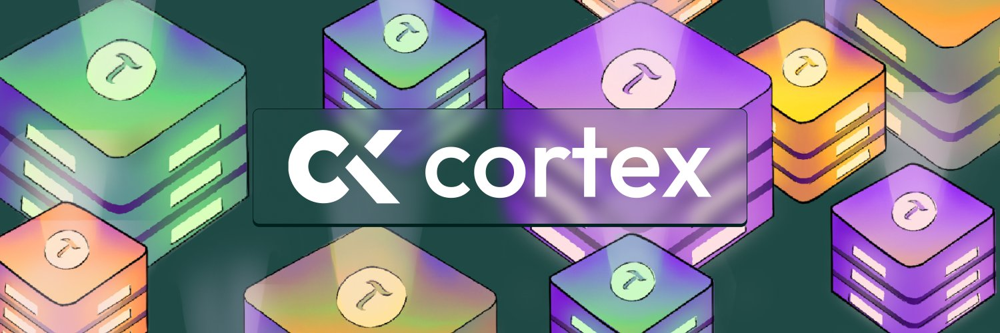

<div align="center">

# Cortex

**Bittensor subnet control plane (Rust).**

[](https://github.com/CortexLM/cortex/actions/workflows/ci.yml)
[](https://github.com/CortexLM/cortex/blob/main/LICENSE)
[](https://bittensor.com/)



</div>

> **Contributing, human or agent?** Read [`.rules/`](.rules/00-overview.md)
> first — all of it — then [`AGENTS.md`](AGENTS.md). This README is the only
> human-facing document in the repo; `.rules/` is the enforceable contract for
> changing it.

## Contents

- [What it is](#what-it-is) · [Challenges](#challenges) · [Architecture](#architecture)
- [Build and test](#build-and-test) · [Run it locally before prod](#run-it-locally-before-prod)
- [Miners](#miners) · [Validators](#validators) · [Images](#images)
- [Versioning](#versioning) · [Where things live](#where-things-live) · [License](#license)

## What it is

Cortex ([`CortexLM/cortex`](https://github.com/CortexLM/cortex)) is the Rust
control plane for a Bittensor subnet with two live challenges. Challenge
services on the **master** host accept miner work over HTTP (`ctx`); the
**gateway** (master-only) seals an epoch weight bundle. Validators **fetch**
`GET /v1/weights/latest`, recompute the vector from the sealed bundle, and
submit on-chain weights. Validators never execute challenges.

Design goals, in one list:

- A lighter Rust control plane than the prior Python stack.
- The gateway runs **only** as the subnet owner: startup asserts its hotkey
  equals the on-chain `SubnetOwnerHotkey` or exits `2` before it binds.
- Validators **recompute** weights from a signed, merkle-rooted bundle. Challenge
  keys and measurements come from **owner-signed local files**, never over
  gateway HTTP.
- CRV4 timelock commit-reveal on testnet/mainnet as configured; reveal is
  automatic on-chain.
- Miners submit over **HTTP**. There is no miner Phala/CVM path (agent-v1 and
  Harbor pack executors were removed).

Some env vars, host paths, GHCR package names, and crypto domain tags still
spell `BASE_*` / `base`. That is leftover naming, not a second product — see
[`.rules/60-naming.md`](.rules/60-naming.md).

## Challenges

| Challenge | id | How miners submit | Default emission |
|-----------|-----|-------------------|------------------|
| **Bounty** | `bounty` | Pair + signed reports; subnet **reads** CortexLM/backend public JSON | 7000 bps |
| **Proof** | `proof` | `POST /v1/submissions` with a `topic_id`; digest-pinned RLM judge | 3000 bps |

Proof's `eval_image_digest` is empty (submits **503**), so 7000/3000 keeps
most emission payable. Retune to 5000/5000 in the same ceremony that pins a
non-empty proof-eval digest. The sum is 10000. `relearn`, `relearn-image`,
`relearn-agent`, `relearn-mm`, `design`, and `prism` are **off**: no
trust-root row, no emission. Frozen contracts for the archived challenges
stay under [`.rules/contracts/`](.rules/contracts/README.md).

Bounty pays precision times severity; an unpriced `valid` row is not
creditable, and the triage-noise ratio stays off the visible score. Proof
scores the mean of per-topic lattices over currently `open` operator-published
topics; empty `eval_image_digest` or an empty open set fails closed (`503`).

## Architecture

```text
Miners --HTTP--> gateway (TLS) --proxy--> bounty-challenge / proof-challenge
                                          | challenge-signed leaves
                                          v
                              gateway seals EpochBundleV1
                                          |
Validators <--- GET /v1/weights/latest ---+
     |
     +--> on-chain set_weights / CRV4 timelock
```

One epoch, end to end:

1. **Pin** — the seal path pins `block_hash` / metagraph root at the epoch
   boundary.
2. **Leaves** — challenges sign `Score` / `NoScore` leaves for the
   validator-derived expected set (D24). A tip epoch may *supersede* a leaf when
   its signed `payload_digest` changes; identical digests are idempotent.
3. **Seal** — the gateway builds `EpochBundleV1`, computes the merkle root, and
   signs the body. The merkle root is **not** in the on-chain weight payload.
4. **Distribute** — `GET /v1/weights/latest` serves the newest revision of the
   highest chain-scale sealed epoch. Unsealed or decode-error responses are a
   **burn vector** (uid 0 = 100%, `sealed: false`), never a 404.
5. **Verify** — each validator loads **local** owner-signed `challenges.toml` +
   `measurements.toml` and rejects leaves signed by unknown keys (D18).
6. **Cross-check** — hotkey-authenticated peer root exchange with a minimum
   sample (D26); signed bundle + peer statements persist as local evidence.
7. **Recompute** — integer aggregation (Hamilton, house 65535) compared against
   the gateway's `final_vector`.
8. **Submit** — `WeightsTlockPayload { hotkey, uids, values, version_key }` only,
   with the CRV4 reveal round derived from schedule inputs (D22).

| Process / crate | Role |
|-----------------|------|
| `gateway` | Master-only: registry, reverse proxy, bundle seal/serve, sole TLS owner |
| `validator` | Fetch/mirror bundle, verify, recompute, peer cross-check, CRV4 submit, dissent |
| `bounty-challenge` | Master-only: pair + reports; scores from CortexLM/backend public feed |
| `proof-challenge` | Master-only: topic submit, RLM judge rent, sign leaves |
| `updater` | Digest-pinned rollouts via `docker-socket-proxy` (master) |
| `trustroot` | Offline keygen / sign / verify for owner-signed TOML |
| `bundle` / `aggregate` | SCALE bundle types + seal/verify; integer aggregation |
| `crosscheck` / `dissent` | Peer roots and the three-outcome policy |
| `db` | Postgres persistence (bundles, evidence, dissent, challenge tables) |
| `xtask` | Repo gates: loc-cap, consensus-lint, spec/design/external-docs, rules-check, version |

Byte-level contracts are frozen in
[`.rules/contracts/`](.rules/contracts/README.md); the honest security claim and
what it excludes is [`.rules/contracts/THREAT_MODEL.md`](.rules/contracts/THREAT_MODEL.md).

## Build and test

Rust **1.96.0**, pinned by `rust-toolchain.toml`. Workspace members are
`crates/*`, `bins/*`, and `xtask`.

```bash
cargo test --workspace
```

That is the core gate. Everything CI runs, in order:

```bash
cargo fmt --all -- --check
cargo clippy --workspace --all-targets -- -D warnings
cargo test --workspace
cargo deny check
cargo run -p xtask -- loc-cap
cargo run -p xtask -- consensus-lint
cargo run -p xtask -- spec-check
cargo run -p xtask -- design-check
cargo run -p xtask -- external-docs-check
cargo run -p xtask -- rules-check
cargo run -p xtask -- version check
cargo clippy -p validator-bin --features dcap --all-targets -- -D warnings
bash deploy/scripts/assert-compose-matrix.sh
```

Optional local hooks matching the cheap half of CI:

```bash
./scripts/install-githooks.sh
```

The authoritative list, plus the challenge-submission and pre-prod checks, is
[`.rules/20-pre-prod-local.md`](.rules/20-pre-prod-local.md).

## Run it locally before prod

Nothing reaches staging or prod before the full stack is green on a developer
machine. `local-e2e.sh` brings up master + gateway + validator + challenges
against Finney **testnet netuid 541**, with an optional ephemeral public URL.

```bash
./deploy/scripts/materialize-env.sh        # deploy/env/*.env, mode 0600
./deploy/scripts/local-e2e.sh --dry-run    # plan + compose render, no containers
./deploy/scripts/local-e2e.sh --smoke      # stack + healthz + weights seal smoke
./deploy/scripts/local-e2e.sh --live       # owner wallet + REQUIRE_OWNER=1
./deploy/scripts/local-e2e.sh --down       # teardown
./deploy/scripts/local-e2e.sh --help       # authoritative flags
```

| Probe | URL |
|-------|-----|
| gateway | `http://127.0.0.1:8080/healthz` |
| sealed weights | `http://127.0.0.1:8080/v1/weights/latest` |
| validator | `http://127.0.0.1:28080/healthz` |
| bounty | `http://127.0.0.1:28096/health` |
| proof | `http://127.0.0.1:28100/health` |

`--smoke` runs `weights-smoke`: signed leaves → `POST /v1/admin/seal` → assert
`GET /v1/weights/latest` is 200 with `sealed: true`. It needs `gateway_sk` and a
challenge signing key whose pub matches the local trust root — **not** a gateway
owner wallet. Prereqs, secrets layout, and the compose matrix are in
[`deploy/AGENTS.md`](deploy/AGENTS.md) and [`deploy/README.md`](deploy/README.md).

Healthz alone never proves a challenge works: simulate a real submission
(bounty pair+report, proof topic submit), the failure edges, and the seal. See
[`.rules/20-pre-prod-local.md`](.rules/20-pre-prod-local.md) § 4.

## Miners

HTTP submit only. Start at
[`.rules/contracts/external-miner/`](.rules/contracts/external-miner/README.md).

- **[How to mine — Bounty](.rules/contracts/external-miner/bounty.md)**
- **[How to mine — Proof](.rules/contracts/external-miner/proof.md)**
- **[How to validate](.rules/contracts/external-miner/validators.md)**

```text
https://<gateway>/challenge/bounty/...
https://<gateway>/challenge/proof/...
```

Never put mnemonics or challenge signing keys in a miner client. Hotkeys are
public 64-hex identifiers.

## Validators

Weight-only path after seal:

```bash
curl -fsS "$GATEWAY/v1/weights/latest"
```

Then `set_weights` / CRV4 with the validator wallet. Operator compose:

```bash
./deploy/scripts/materialize-env.sh
docker compose up -d                  # postgres, validator, updater, socket-proxy
docker compose --profile master up -d # + gateway (subnet owner host only)
```

## Images

`.github/workflows/images.yml` builds digest-pinned images. The registry path is
still `ghcr.io/baseintelligence/base/<suffix>` (historical package name; see
[`.rules/60-naming.md`](.rules/60-naming.md)). Never `:latest` in a measured
compose path.

| Target | Image suffix |
|--------|--------------|
| validator | `validator` |
| gateway | `gateway` |
| updater | `updater` |
| bounty-challenge | `bounty-challenge` |
| proof-challenge | `proof-challenge` |

## Versioning

The single source of truth is `[workspace.package] version` in the root
`Cargo.toml`; all members inherit it and `Cargo.lock` is derived from it. There
is no `VERSION` file and no second packaging system.

```bash
cargo run -p xtask -- version          # print the current version
cargo run -p xtask -- version check    # members inherit + Cargo.lock in sync
cargo run -p xtask -- version bump     # level derived from Conventional Commits
```

`feat` → minor, breaking → major (minor while the major is `0`), everything else
→ patch. CI fails a pull request that does not bump the version. Prod ships from
annotated tags `vX.Y.Z` cut on `main`. Full rules:
[`.rules/50-versioning.md`](.rules/50-versioning.md).

## Where things live

| Need | Path |
|------|------|
| Agent + PR contract (read first) | [`.rules/00-overview.md`](.rules/00-overview.md) |
| BIP39 mnemonics / wallet JSON / audit logs | [`.rules/70-secrets-mnemonics.md`](.rules/70-secrets-mnemonics.md) |
| Repo map, non-negotiables, verification duties | [`AGENTS.md`](AGENTS.md) |
| Frozen specs, threat model, miner docs | [`.rules/contracts/README.md`](.rules/contracts/README.md) |
| Deploy topology, promote/rollback, secrets | [`deploy/README.md`](deploy/README.md), [`deploy/AGENTS.md`](deploy/AGENTS.md) |
| Trust-root ceremony | [`config/CEREMONY.md`](config/CEREMONY.md) |
| Reporting a vulnerability | [`SECURITY.md`](SECURITY.md) |
| Code owners | [`CODEOWNERS`](CODEOWNERS) |

## License

Apache License 2.0 — see [LICENSE](./LICENSE).
