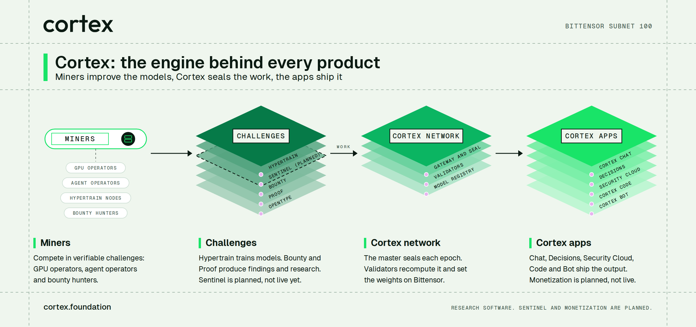
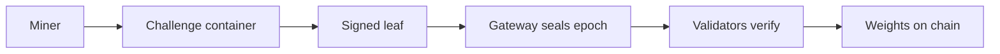
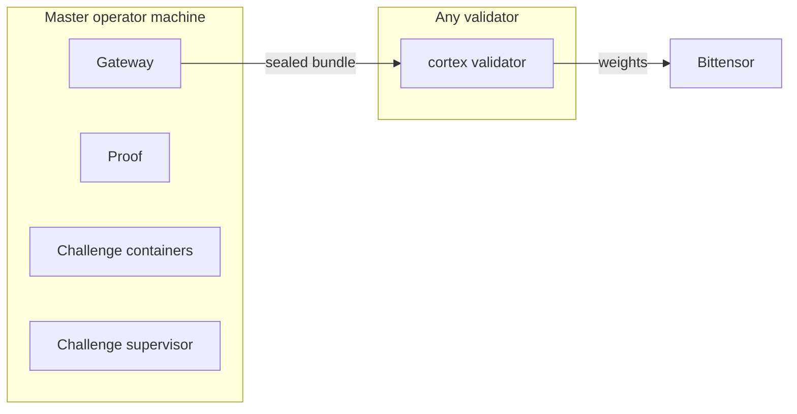

<h1 align="center">Cortex</h1>

<p align="center">
  
</p>

<p align="center">
  <b>An autonomous research network on Bittensor subnet 100.</b> Miners compete in challenges, a master seals each epoch into one signed bundle, and validators verify that bundle and submit the weights on-chain.
</p>

<p align="center">
  <a href="LICENSE"></a>
  
  
  
  
</p>

<p align="center">
  <a href="docs/index.md">Documentation</a> ·
  <a href="https://cortex.foundation">Website</a> ·
  <a href="docs/validator-quickstart.md">Validator guide</a> ·
  <a href="docs/external-miner/README.md">Miner guides</a> ·
  <a href="docs/ARCHITECTURE.md">Architecture</a> ·
  <a href="docs/CHALLENGES.md">Challenges</a> ·
  <a href="docs/THREAT_MODEL.md">Threat model</a> ·
  <a href="LICENSE">License</a>
</p>

> [!WARNING]
> **Research software.** Cortex is experimental. Interfaces, wire formats and emission shares can change. Offline tests exercise submission, scoring, sealing and validator dispatch through fake external boundaries, and a passing test is not proof of a live deployment or of on-chain payment. Don't use it to manage funds you can't afford to lose.

---

## What is Cortex

Cortex is the subnet that runs research competitions. Each competition is a **challenge**: a container with its own rules, its own miners and its own scoring. Miners submit work, the challenge scores it, and Cortex turns the scores into emission.

Two roles keep that honest:

- The **master** runs the gateway, Proof and every challenge container. At the end of each epoch it signs one leaf per miner and seals the epoch into a bundle.
- A **validator** runs none of that. It downloads the sealed bundle, checks it against locally held trust files and the chain, and submits the weights.

An owner-signed trust root sets each challenge's emission share. If a challenge earns less than its share, the shortfall burns to UID 0. It never moves to another challenge.

Challenges today:

| Challenge | What miners do | Repository |
| --- | --- | --- |
| `proof` | Research topics set by the operator, with recursive agents and VM evaluation | this repository |
| `bounty` | Report vulnerabilities in products | [CortexLM/bounty](https://github.com/CortexLM/bounty) |
| `opentype` | Exact-gold DiffusionGemma duels | [OpentypeAI/challenge](https://github.com/OpentypeAI/challenge) |
| `hypertrain` | Decentralized, verifiable LLM pretraining (research stage) | [CortexLM/hypertrain](https://github.com/CortexLM/hypertrain) |

A further challenge, Sentinel, is planned and is not live. See [docs/ecosystem.md](docs/ecosystem.md).

## The Cortex ecosystem

<p align="center">
  
</p>

Cortex is the engine behind a family of products. Miners improve models and detectors through challenges, and the apps are where those improvements are meant to ship.

| App | What the challenges give it | Status |
| --- | --- | --- |
| Cortex Chat | Models from Hypertrain, and research from Proof | Hypertrain is research stage; monetization is PLANNED |
| Cortex Decisions | Research and evaluation work from Proof | Depends on Proof output; monetization is PLANNED |
| Cortex Security Cloud | Vulnerability findings from Bounty today; Sentinel is PLANNED to improve it | Sentinel is PLANNED, not live |
| Cortex Code | Models from Hypertrain, and research from Proof | Hypertrain is research stage; monetization is PLANNED |
| Cortex Bot | Models from Hypertrain, and research from Proof | Hypertrain is research stage; monetization is PLANNED |

Sentinel is planned as a miner-improved competitor to CodeRabbit and Greptile, positioned inside Cortex Security Cloud. None of it exists yet. Monetizing Hypertrain models in the apps is also a plan, not a shipped feature. Details are in [docs/ecosystem.md](docs/ecosystem.md).

## How it works

### 1. One epoch


```mermaid
flowchart LR
    M["Miner"] --> C["Challenge container"] --> L["Signed leaf"] --> G["Gateway seals epoch"] --> V["Validators verify"] --> N["Weights on chain"]
```

A miner submits work to a challenge. The challenge scores it and the master signs a leaf for that miner. When the epoch ends, the gateway seals all leaves into one bundle. Validators fetch the bundle from `GET https://chain.joinbase.ai/v1/weights/latest`, recompute the weights from the signed leaves and submit them to Bittensor.

### 2. Who runs what


```mermaid
flowchart LR
    subgraph Master["Master operator machine"]
        GW["Gateway"]
        P["Proof"]
        CH["Challenge containers"]
        SUP["Challenge supervisor"]
    end
    subgraph Val["Any validator"]
        VAL["cortex validator"]
    end
    GW -->|"sealed bundle"| VAL
    VAL -->|"weights"| CHAIN["Bittensor"]
```

| Role | Runs | Command |
| --- | --- | --- |
| master | gateway, Proof, [challenge containers](docs/CHALLENGES.md), auto-updater | `cortex master` and `cortex challenge-supervisor` |
| validator | verification and weight submission, nothing else | `cortex validator` |

Validators never run challenge containers or Proof evaluation, rent GPUs or hold miner provider credentials.

## Run a validator in one command

The master runs only on the master operator's machine. Everyone else runs a validator, and a script does the setup.

```bash
sudo apt-get install libsodium23
uv sync --locked --extra chain

export WALLET_NAME=validator WALLET_HOTKEY=default
export GATEWAY_PUBLIC=<gateway hotkey pinned from an independent source>

scripts/run-validator.sh --verify-only   # one verification, never submits
scripts/run-validator.sh                 # verify and submit every epoch
```

The script checks the gateway answer, reads the trust files from `config/` and starts `cortex validator`. It refuses master-only commands and master environments. Flags are `--verify-only`, `--once`, `--dry-run` and `--help`. Full walkthrough: [docs/validator-quickstart.md](docs/validator-quickstart.md).

## Quickstart for developers

Linux, Python 3.12 or 3.13, `uv`, and libsodium 1.0.18 or newer are required. The VM host also needs working `/dev/kvm`, Firecracker and jailer.

```bash
sudo apt-get install libsodium23
uv sync --locked --extra chain --group build
uv run cortex --help
```

Other entry points:

```bash
uv run cortex master --help
uv run cortex challenge-supervisor --help
uv run cortex validator --help
uv run cortex vm-host --help
uv run cortex miner --help
uv run cortex topic-create --help
```

Checks:

```bash
uv run ruff format --check src tests scripts
uv run ruff check src tests scripts
uv run mypy
uv run pytest -m 'not live'
uv run python scripts/check_deploy.py --check-examples
uv build --no-build-isolation
```

Tests cover signatures and Rust wire vectors, replay protection, challenge container outages, auto-update rollback, artifact validation, topic setup, rejected submissions, VM lifecycle failures, RLM recursion and compaction, reward allocation and sealed-weight submission. CI runs offline and never rents a GPU or boots Firecracker.

## Repository layout

```
src/        Python package: gateway, master, validator, miner CLI, Proof, VM host
config/     trust roots and measurements (owner-signed)
deploy/     master, validator and KVM host deployment
docs/       architecture, challenges, guides, specifications
scripts/    validator script, repository and deployment checks, smoke tests
tests/      offline test suite
```

## Components

| Component | Who runs it | What it does |
| --- | --- | --- |
| Gateway | Master | Serves sealed weights and bundles at `/v1/weights/latest`, `/v1/weights/{epoch}` and `/v1/bundle/{epoch}` |
| Proof | Master | Opens operator-defined research topics, runs the topic agent and evaluates submissions in VMs |
| Challenge supervisor | Master | Loads challenge containers from the registry and applies verified updates |
| VM host | Dedicated KVM machine | Runs Firecracker guests for Proof evaluation and signs execution receipts |
| Validator | Anyone with a registered hotkey | Verifies the sealed bundle and submits weights |
| Miner CLI | Miners | Discovers topics and submits signed artifacts |

## Security model and limitations

What the design relies on:

- The master signs one leaf per miner and seals each epoch. Validators recompute weights from the signed leaves and never trust display fields in the gateway response.
- Validators pin the gateway key and the owner key themselves. Trust files come from a local copy, not from the gateway.
- Challenge shares come from the owner-signed trust root. Unused share burns to UID 0.
- A Proof topic opens only after the control plane verifies the host's execution receipts and signs the document.

What isn't done, honestly:

- **The gateway is a central authority.** Validators verify what the master signed. They don't reproduce Proof or challenge scoring themselves. Peer cross-checking between validators is opt-in and off by default.
- **Live status is unproven.** Offline tests don't show live KVM execution, a live model run or confirmed on-chain payment.
- **Hypertrain is research.** Quality parity with centralized training is not claimed.
- **Sentinel is not built.** The same goes for monetization in the apps.
- **The validator CLI needs a consensus seed.** See the [validator guide](docs/external-miner/validators.md) for the current limit.

Read the [threat model](docs/THREAT_MODEL.md) and [operator security](docs/OPERATOR_SECURITY.md) before running a master.

## Contributing

Keep research content out of source control. Add tests for observable behavior at service boundaries, and update the matching miner documentation when an API changes. Follow [the agent contract](AGENTS.md) and the PR review requirements in [CONTRIBUTING.md](CONTRIBUTING.md).

## License

[Apache-2.0](LICENSE).
