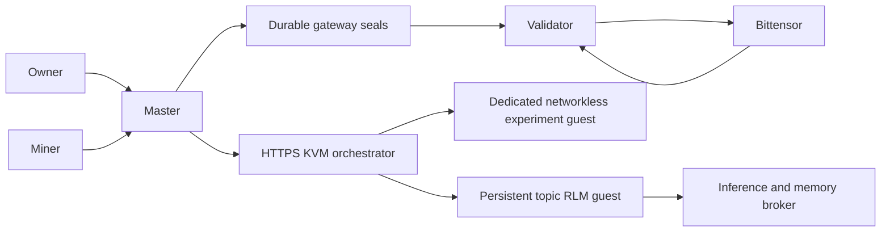

# Architecture

Cortex has two scoring products. Algorithm 2 assigns Bounty 3,000 basis points
and Proof 7,000. The owner-signed legacy 2,000/8,000 profile retains algorithm 1;
see [activation](how-to/trust-root.md#activate-proportional-bounty).
The signed trust root fixes their shares. All challenge execution belongs to
the master; validators independently verify sealed bundles and submit weights.

## Source map

| Directory | Responsibility |
| --- | --- |
| `src/cortex/protocol` | SCALE wire format, signatures, Merkle roots, aggregation, trust roots |
| `src/cortex/gateway` | Durable raw leaves and immutable sealed bundles |
| `src/cortex/validator` | Independent historical chain reads and exact weight submission |
| `src/cortex/bounty` | Pairing, reports, adjudication and external-feed scoring |
| `src/cortex/proof` | Signed topics, setup, intake, evidence, quotas and payouts |
| `src/cortex/rlm` | OpenRouter protocol, recursion, budgets, checkpoints and memory |
| `src/cortex/vm` | Firecracker lifecycle, guest tools, setup export and host callbacks |
| `src/cortex/master.py` | Composition, epoch tracking, job recovery and leaf emission |
| `src/cortex/cli.py` | Operator, miner, master and validator commands |
| `tests` | Domain, service, protocol and lifecycle regressions |

## Proof lifecycle

An authenticated owner submits an objective and optional metric constraints.
The RLM runs in a guest bound to that topic. Setup can install dependencies,
create evaluator code and build a private holdout pack. The host verifies the
exact exported bytes. A baseline runs in a fresh networkless experiment guest.
The control plane checks report identities, actual metrics, pack commitments,
budgets and confirmed guest destruction before publishing a signed Topic v2.

Miner submissions bind hotkey, topic, artifact digest, claim, manifest, FLOPs
and nonce under the preserved submission domain. Environment values are validated
before signature/nonce reservation and stored only in a private file vault.
Accepted jobs survive client disconnects. Every evaluation uses its frozen topic
revision; later rule revisions cannot erase its already-earned score.

A deterministic preflight checks the full signed checklist before the first
model call. The host independently blocks inference until those checks pass.
Only a measured experiment receipt can support an accepted verdict. WTA awards
topic mass to the best result; discovery divides pass-floor and novelty mass.
Historical champions and exact artifact matches prevent repeated novelty claims.

## RLM state

All recursive children share the parent's calls, tokens, tools, depth and wall
budget. Compaction preserves immutable policy, completed phases and measured
evidence; exact removed exchanges remain accessible by content digest. Journals
persist before external side effects. An interrupted VM operation requires
orchestrator reconciliation rather than an automatic duplicate paid execution.
An invalid child research summary receives bounded correction feedback; memory
archive digests cannot stand in for execution report digests. Corrections consume
the same shared budgets and do not replay completed VM work. Root setup proposals
and scoring verdicts still fail closed when their evidence is invalid.
Explicit agent recovery requires the original running topic VM and guest
checkpoint. Host progress retains the original deadline, spent budgets and
verified evidence. Lost VM responses are recovered by execution ID from completed
ledger records with exact request binding and confirmed experiment destruction.
Missing state or an unresolved VM outcome refuses recovery without replay.

Topic guests access shared research memory through a scoped host callback.
New observations remain untrusted. Owner-signed approval binds exact content,
visibility and verification evidence. Approved public knowledge is visible to
other topics; private knowledge stays scoped to its topic. Memory never changes
published rules without a separately signed revision.

## Reward boundary

The master records chain epochs and snapshot blocks durably. It emits exact
participant coverage for both challenges and seals completed epochs only after
accepted jobs and in-flight intake have finished. A failed challenge emits signed
`NoScore(ChallengeInternal)` rather than leaving the epoch uncovered.

Validators recompute the bundle against independent chain state. Missing or
corrupt latest seals expose an unsealed UID0 fallback that validators refuse.
A valid sealed UID0 burn remains a valid submission. Ambiguous chain dispatches
remain pending in the journal to prevent duplicate submission after restart.

## Compatibility and limits

The bundle/SCALE/signature contracts preserve cross-language vectors. Topic and
VM JSON protocols are explicitly version 2; old JSON topic signatures are not
silently reinterpreted. The custom Schnorrkel signing context uses Python Merlin
transcripts and native libsodium Ristretto operations; keep its vectors and
security review when changing crypto.

The built-in HTTPS backend supports custom Firecracker topics. Lium harvest
families remain unavailable unless an evaluation backend implementing their
pinned offer and execution contracts is installed. Live KVM boot, scientific
validity of generated evaluators and confirmed on-chain payment require separate
operational evidence; offline tests and a successful model call do not prove them.
