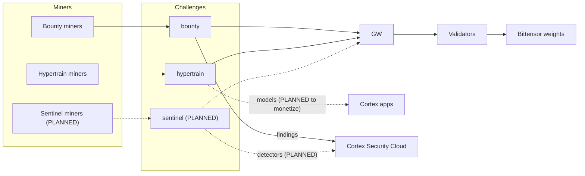

# Cortex ecosystem

Cortex is a Bittensor subnet (netuid 100) that runs research challenges. It is also the engine behind a family of products: Cortex Chat, Cortex Decisions, Cortex Security Cloud, Cortex Code and Cortex Bot. This page explains how the pieces connect. Website: <https://cortex.foundation>.

Anything marked PLANNED doesn't exist yet.

## Architecture

## Challenges

| Challenge | Repository | What it produces | Status |
| --- | --- | --- | --- |
| `bounty` | [CortexLM/bounty](https://github.com/CortexLM/bounty) | Vulnerability reports | Loaded as a container |
| `hypertrain` | [CortexLM/hypertrain](https://github.com/CortexLM/hypertrain) | Models from decentralized, verifiable pretraining | Research stage |
| `sentinel` | none yet | Detectors for code review and security | PLANNED, not live |

Each challenge is its own container with its own repository. The owner-signed trust root sets its emission share, and the contract is in [CHALLENGES.md](CHALLENGES.md).

## Apps

| App | Relation to Cortex |
| --- | --- |
| Cortex Chat | Meant to use models that Hypertrain produces. PLANNED. |
| Cortex Decisions | Meant to use models that Hypertrain produces. PLANNED. |
| Cortex Security Cloud | Can use Bounty findings. Sentinel is PLANNED to improve it. |
| Cortex Code | Meant to use models that Hypertrain produces. PLANNED. |
| Cortex Bot | Meant to use models that Hypertrain produces. PLANNED. |

The apps are separate products. This repository doesn't contain them, and a challenge result doesn't reach an app automatically.

## Value flow

1. Miners do work in a challenge and compete on its score.
2. The master seals the scores into a bundle, and validators turn the bundle into on-chain weights. This part is built.
3. The improved models and detectors are meant to ship in the apps, and the apps are meant to earn revenue from them. This part is PLANNED.

So the flow is miners improve models and detectors, and the apps ship and monetize them. Today only step 1 and 2 exist in this repository. Hypertrain is research stage, and no model it trained has shipped in an app.

## Planned: Sentinel

Sentinel is a future challenge. It is not live and has no repository, container or emission share yet.

The plan is for miners to improve code review and security detectors, with the result feeding Cortex Security Cloud. Cortex Security Cloud would then compete with products such as CodeRabbit and Greptile, on the claim that miners keep improving it. That claim is untested. Nothing here promises a date, a design or a share.

When Sentinel ships, it would load like any other challenge: its own container, a share in the owner-signed trust root and leaves sealed by the master.
